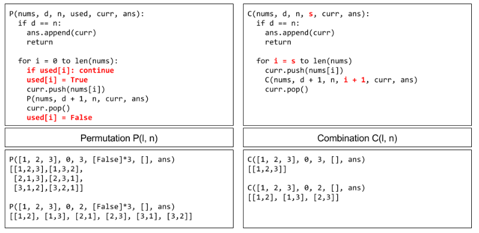
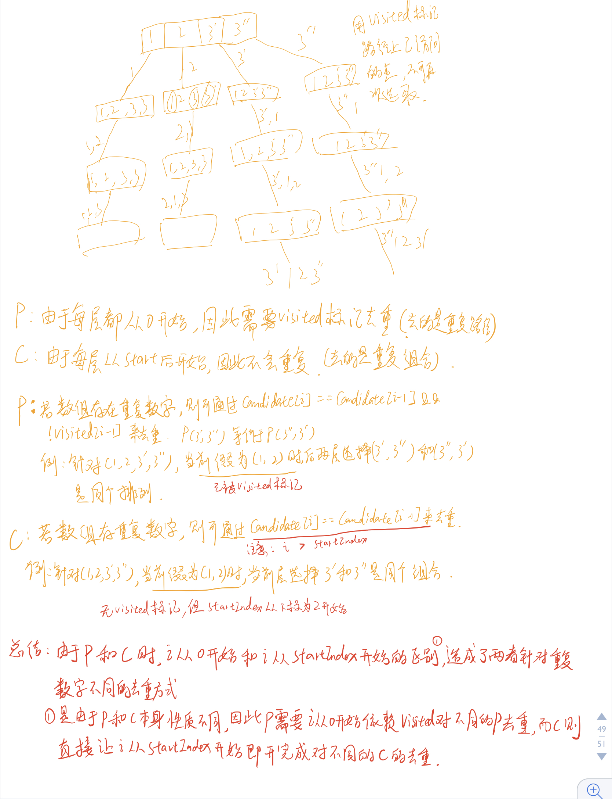

# LeetCode记录总结

本文章主要记录LeetCode刷题学到的知识

<!--more-->

## 242.Valid Anagram    

题目：

> Given two strings s and t , write a function to determine if t is an anagram of s.
>

我的解法：

```java
class Solution {
      public boolean isAnagram(String s, String t) {
     if ((s.isEmpty() && !t.isEmpty())||s.length()!=t.length()) {
            return false;
        }
        char[] tchars = t.toCharArray();
        char[] schars = s.toCharArray();
       Arrays.sort(tchars);
        Arrays.sort(schars);
         for (int i = 0; i < tchars.length; i++) {
            if (tchars[i] != schars[i]) {
                return false;
            }
        }
        return true;
    }
}
```

思路是想通过将字符串排序，然后逐一对比字符。看到官方有种解法是通过哈希映射，先准备一个26长度的int数组，将每个字符与`a`相减得出对应的ASCII码，将其作为数组的下标，s的字符对下标上的值++，t的字符对下标上的值--。最后，判断这个数组有没有不为0的，若不为0，则说明字符不一样。**以后遇到字符串比较的问题，可以往数组映射上进行考虑**

```java
public boolean isAnagram(String s, String t) {
    if (s.length() != t.length()) {
        return false;
    }
    int[] counter = new int[26];
    for (int i = 0; i < s.length(); i++) {
        counter[s.charAt(i) - 'a']++;
        counter[t.charAt(i) - 'a']--;
    }
    for (int count : counter) {
        if (count != 0) {
            return false;
        }
    }
    return true;
}
```

这题的follow up是，如果字符串是unicode编码的，那么怎么实现。那样的话我的这种解法依然有效，但是使用定长数组的解法则不行，需要使用hashmap来代替数组。

Unicode相关：[字符编码笔记：ASCII，Unicode 和 UTF-8](http://www.ruanyifeng.com/blog/2007/10/ascii_unicode_and_utf-8.html)

## LCCI.01.01 Is Unique

题目：

> Implement an algorithm to determine if a string has all unique characters. What if you cannot use additional data structures?
>

我的思路是直接采用整形数组，将每个字符与`A`相减得出的数字作为数组下标，将数组的值+1，当发现某个字符对应的数组值大于1时，则说明该字符重复了，返回false。

题目说的是不采用其他数据结构，而我用了数组来解，其实也是一种数据结构。看了题解，发现可以用整形的bit位代替数组，将每个字符与`A`的差作为数字1的左移位数，这样每次和mark的值相与，若字符没重复着则会为0，不为0则说明重复了。在不重复的时候，用或运算来将mark的bit位置位。贴出我修改后的解：

```java
 public boolean isUnique(String astr) {
        if (astr.isEmpty()) {
            return true;
        }
        char[] chars = astr.toCharArray();
        long flag =0;
        for (char aChar : chars) {
            long i = aChar - 'A';
            if ((flag & (1L << i)) != 0) {
                return false;
            }else {
                flag =flag|(1L << i);
            }
        }
        return true;
}
```

## LCCI.01.02 Check Permutation

题目：

> Given two strings,write a method to decide if one is a permutation of the other.
>

此题类似与#242 valid anagram 那道题。可以采用相同的解法。但是看到题解里有采用异或的方式来解的，异或本身的原理是：`0^a=a;1^a=a取反`。因此当用0跟字符串每个字符异或后，得到的值是字符串每个字符相异或的。这样对两个字符串进行异或后再对两个值进行比较，若相等则说明是同个字符串，否则为不同字符串。

解法如下：

```java
 public boolean CheckPermutation(String s1, String s2) {
        if (s1 == null || s2 == null) {
            return s1 == null && s2 == null;
        }
        char[] s1Chars = s1.toCharArray();
        char[] s2Chars = s2.toCharArray();
        int a = 0;
        int b = 0;
        for (char s1Char : s1Chars) {
            a = a ^ s1Char;
        }
        for (char s2Char : s2Chars) {
            b = b ^ s2Char;
        }
        return a == b;
    }
```

## LCCI.01.03 String toURL 

题目：

> Write a method to replace all spaces in a string with '%20'. You may assume that the string has sufficient space at the end to hold the additional characters,and that you are given the "true" length of the string. (Note: If implementing in Java,please use a character array so that you can perform this operation in place.)
>

刚开始理解错了题目的意思，以为要将字符串中的空格全部替换为`%20`，后来测试才发现，需要转换的字符串其实是给定的长度，所以只需要遍历字符串，将给定长度内的空格字符替换为`%20`即可。

解法如下：

```java
public String replaceSpaces(String S, int length) {
        if (length <= 0) {
            return null;
        }
        StringBuilder res = new StringBuilder();
        char[] charArray = S.toCharArray();
        for (int i = 0; i < length; i++) {
            char c = charArray[i];
            if (c == ' ') {
                res.append("%20");
            } else {
                res.append(c);
            }
        }
        return res.toString();
    }
```

## LCCI.01.04 Palindrome Permutation

题目：

> Given a string, write a function to check if it is a permutation of a palin­ drome. A palindrome is a word or phrase that is the same forwards and backwards. A permutation is a rearrangement of letters. The palindrome does not need to be limited to just dictionary words.
>

可以把题目中的回文字符串理解为一个字符串中字母出现次数为奇数的不超过1个。理解了这个之后，就可以使用哈希映射的方式来解决这个问题了，先将每个字母对应的数字放到数组中，然后将数组的值奇数，作为出现此处。最后判断次数是否为奇数即可。此处判断是否为奇数可以使用`(a&1)==1`来判断，若位与后结果为1，则说明是奇数。

关于位运算总结可以参考这篇博客：[位运算总结](http://blog.tomtung.com/2007/05/bitwise-operation/)

```java
    public boolean canPermutePalindrome(String s) {
        if (s==null|| s.isEmpty()) {
            return false;
        }
        char[] chars = s.toCharArray();
        HashMap<Character, Integer> letters = new HashMap<>();
        for (char aChar : chars) {
            letters.merge(aChar, 1, (a, b) -> a + b);
        }
        int flag=0;
        for (int letter : letters.values()) {
            if (((letter&1)==1)&& (++flag)>1) {
                return false;
            }
        }
        return true;
    }
```

## LCCI.01.05 One Away

题目：

> There are three types of edits that can be performed on strings: insert a character, remove a character, or replace a character. Given two strings, write a function to check if they are one edit (or zero edits) away.
>

此题并不是单词的判断字符串少了几个字符的问题，而是两个字符串除了不一样的那个字符外，其他字符的顺序也需要一直。没有想到更好的办法，于是我采用的是双指针暴力法。双指针类的题目需要分清不同情况下两个指针的处理，在这题中，两个字符串长度相差大于1肯定返回false，其他的分为长度相同和长度相差为1来分别处理。长度相同时，最多有一个字符可以不一样。长度相差为1时，短字符串的顺序必须与长字符串一样。

```java
   public boolean oneEditAway(String first, String second) {
        if (first == null || second == null) {
            return true;
        }
        String longer = first.length() >= second.length() ? first : second;
        String shorter = first.length() < second.length() ? first : second;
        if (longer.length() - shorter.length() > 1) {
            return false;
        }
        if (longer.isEmpty() || shorter.isEmpty()) {
            return longer.length() - shorter.length() <= 1;
        }
        int flag = 0;
        int i = 0;
        int j = 0;
        if (longer.length() == shorter.length()) {
                    
            for (int k = 0; k < longer.length(); k++) {
                if (longer.charAt(k) != shorter.charAt(k)) {
                    flag++;
                    if (flag > 1) {
                        return false;
                    }
                }
            }
        }else {
            for (; j < shorter.length(); ) {
                if (longer.charAt(i) != shorter.charAt(j)) {
                    i++;
                    flag++;
                    if (flag > 1) {
                        return false;
                    }
                    continue;
                }
                i++;
                j++;
            }
        }
        return true;
    }
```

## LCCI.01.06 Compress String

题目：

> Implement a method to perform basic string compression using the counts of repeated characters. For example, the string aabcccccaaa would become a2blc5a3. If the "compressed" string would not become smaller than the original string, your method should return the original string. You can assume the string has only uppercase and lowercase letters (a - z).

这题我采用普通的遍历法做出来了，需要注意的是不能使用哈希映射的方法。因为相同字母在不连续位置出现是不能统计到一起去的。看题解中，有同学**在字符的最后补了一位来规避遍历时处理最后一个字符的特殊情况**，这种思路值得学习。还有的同学采用了双指针的思路，一个指针遍历字符，另个指针统计相同的字符个数。

我的解法：

```java
    public String compressString(String S) {
        if (S.isEmpty()||S.length()<3) {
            return S;
        }
        char[] chars = S.toCharArray();
        StringBuilder sb = new StringBuilder();
        int repeat = 1;
        for (int i = 0; i < chars.length; i++) {
            if (i > 0) {
                if (chars[i] == chars[i - 1]) {
                    repeat++;
                    if (i == chars.length - 1) {
                        sb.append(chars[i]).append(repeat);
                    }
                } else {
                    sb.append(chars[i - 1]).append(repeat);
                    repeat = 1;
                    if (i == chars.length - 1) {
                        sb.append(chars[i]).append(repeat);
                    }
                }
            }
        }
        return S.length() <= sb.length() ? S : sb.toString();
    }
```

## LCCI.01.07 Rotate Matrix

题目：

> Given an image represented by an N x N matrix, where each pixel in the image is 4 bytes, write a method to rotate the image by 90 degrees. Can you do this in place?
>

一开始我的解题思路是通过新建一个二维数组，然后，将矩阵进行转换，按照`a=j,b=N-i-j`的逻辑转换，最后再将转换后的数组复制到原数组中。这样会导致空间复杂度为O(N)。看了书本上的解法是原地旋转，由外层向内层每一层都是将上边移到右边，右边移到下边，下边移到左边，左边移到上边。通过这种方式完成整个矩阵的旋转。这种方式的实现逻辑交易较为清晰，时间复杂度为O(N2)。修改我的解法后，如下：

```java
    public void rotate(int[][] matrix) {
        int N = matrix.length;
        if (N <= 1) return;
        for (int layer = 0; layer < N / 2; layer++) {
            for (int j = layer; j < N - layer - 1; j++) {
                int top = matrix[layer][j];
                matrix[layer][j] = matrix[N - j - 1][layer];//left->top
                matrix[N - j - 1][layer] = matrix[N - layer - 1][N - j - 1];//bottom->left
                matrix[N - layer - 1][N - j - 1] = matrix[j][N - layer - 1];//right->bottom
                matrix[j][N - layer - 1] = top;//top->right
            }
        }
    }
```

矩阵旋转时，可以将矩阵的数组下标写出来，然后找出每一步转换的`i，j`的规律。一般无非就是`x=j,y=length-i-1`这种情况。

## LCCI.01.08 Zero Matrix

题目：

> Write an algorithm such that if an element in an MxN matrix is 0, its entire row and column are set to 0.
>

我的思路是将矩阵中应该被清0的行和列分别用数组记录下来。然后再拿行数组和列数组处理矩阵中对应的行和列。但是这样占用的空间复杂度为O(N)。参考书本上给出的优化方案是，将矩阵的第一行和第一列作为行数组和列数组。

```java
	public void setZeroes(int[][] matrix) {
        int rows = matrix.length;
        int cloumns = matrix[0].length;
        int[] rowsToZero = new int[rows];
        int[] cloums = new int[cloumns];
        for (int i = 0; i < matrix.length; i++) {
            for (int j = 0; j < matrix[i].length; j++) {
                if (matrix[i][j] == 0) {
                    rowsToZero[i]=1;
                    cloums[j]=1;
                }
            }
        }
        for (int i = 0; i < rowsToZero.length; i++) {
            if (rowsToZero[i] == 1) {
                //set i row to 0
                for (int j = 0; j < matrix[i].length; j++) {
                    matrix[i][j]=0;
                }
            }
        }
        for (int i = 0; i < cloums.length; i++) {
            if (cloums[i] == 1) {
                for (int j = 0; j < matrix.length; j++) {
                    matrix[j][i]=0;
                }
            }
        }
    }
```

## LCCI.01.09 String Rotation

题目：

> Given two strings, s1 and s2, write code to check if s2 is a rotation of s1 (e.g.,"waterbottle" is a rotation of"erbottlewat"). Can you use only one call to the method that checks if one word is a substring of another?
>

这一题我给它想的复杂了，第一反应是通过双指针来做，结果没有做出来。考虑的情况漏了。看了书本才想起用包含子串的方法应该是最简单的。

```java
    public boolean isFlipedString(String s1, String s2) {
        if (s1.isEmpty() || s2.isEmpty()) {
            return s1.isEmpty() && s2.isEmpty();
        }
        if (s1.length() != s2.length()) {
            return false;
        }
           String s1s1 = s1+s1;
        return s1s1.contains(s2);
    }
```

## LCCI.02.01 Remove Duplicate Node

题目：

> Write code to remove duplicates from an unsorted linked list.

此题的follow up是想让不用额外的空间来实现，于是我直接采用双指针法。一个指针指向尾部，另个之前在前面做判重。这样会增加时间复杂度，为O(N2)；

```java
    public ListNode removeDuplicateNodes(ListNode head) {
        if (head==null || head.next == null) {
            return head;
        }
        ListNode tail = head;
        ListNode p1 = head;
        while (tail.next != null) {
            ListNode next = tail.next;
            boolean nextIsDup = false;
            while (p1 != tail.next) {
                if (p1.val == next.val) {
                    nextIsDup = true;
                    break;
                }
                p1 = p1.next;
            }
            p1= head;
            if (nextIsDup) {
                //delete current node
                tail.next= next.next;
            }else {
                tail = next;
            }
        }
        return head;
    }
```

## LCCI.02.02 Kth Node From End of List

题目：

> Implement an algorithm to find the kth to last element of a singly linked list. Return the value of the element.

这题的第一想法觉得很简单，用遍历就可以实现。看了follow up 说可以用递归和双指针。递归没有什么想法，于是便实现了一个双指针版本的：

```java
    public int kthToLast(ListNode head, int k) {
        ListNode b = head;
        ListNode a = head;
        for (int i = 1; i < k; i++) {
            b=b.next;
        }
        while (b.next != null) {
            b=b.next;
            a=a.next;
        }
        return a.val;
    }
```

贴上题解里的递归解法：

```java
// 递归
class Solution {
    // 开始全局变量 K 保持不变
    int K = 1;
    public int kthToLast(ListNode head, int k) {
        // 当节点在最末尾时触发返回
        if (head.next == null) return head.val;
        // 返回的值
        int val = kthToLast(head.next, k);
        // 一旦触发返回，从第一个产生返回的位置用 K 计数
        if (K++ >= k) {
            // 当到达或超过倒数第 k 时，即 K >= k 时保持返回值不变
            return val;
        } else {
            // 没到达则更新需要返回的值
            return head.val;
        }
    }
}
```

## LCCI.02.03 Delete Middle Node

题目：

> Implement an algorithm to delete a node in the middle (i.e., any node but the first and last node, not necessarily the exact middle) of a singly linked list, given only access to that node.
>

这题我并没有想到解法，其实链表的操作不应该被固定思维给限制住。这题可以通过将当前节点替换为下一节点，并将下一节点删除的方式来实现。代码也非常简单。主要考察的是这种思维。

```java
    public void deleteNode(ListNode node) {
        node.val=node.next.val;
        node.next=node.next.next;
    }
```

## LCCI.02.04 Partition List

题目：

> Write code to partition a linked list around a value x, such that all nodes less than x come before all nodes greater than or equal to x. If x is contained within the list, the values of x only need to be after the elements less than x (see below). The partition element x can appear anywhere in the "right partition"; it does not need to appear between the left and right partitions.
>

这一题我的思路是通过使用双指针来做，一个指针做遍历，另个指针指向小于x的数据的next。若遍历遇到小于x的值，则将其与小于x的next交换即可。

```java
    public ListNode partition(ListNode head, int x) {
        if (head == null) {
            return null;
        }
        ListNode p1 = head;
        ListNode p2 = head;
        while (p2 != null) {
            if (p2.val < x) {
                int temp = p1.val;
                p1.val = p2.val;
                p2.val = temp;
                p1 = p1.next;
            }
            p2 = p2.next;
        }
        return head;
    }
```

此处需要注意的是，当我尝试使用如下异或来做交换操作时：

```java
p1.val = p1.val^p2.val;
p2.val = p1.val^p2.val;
p1.val = p1.val^p2.val;
```

发现在刚开始头指针指向同个对象时，对`p1.val`和`p2.val`做异或操作得出的值为0，再将0复制给`p1.val`，这样使得`p2.val`同时变为了0，因为`p1.val`和`p2.val`指向的是相同的值。

## LCCI.02.05 Sum Lists

题目：

> You have two numbers represented by a linked list, where each node contains a single digit. The digits are stored in reverse order, such that the 1's digit is at the head of the list. Write a function that adds the two numbers and returns the sum as a linked list.

这题一开始我的思路是将链表给合并成整数，再相加，然后再拆成链表。后来看了提示里说尝试用递归，才想到可以用递归来解决这个问题。刚开始的时候，递归写出来了，但是有几个用例总是执行不过，原因是我用的整型变量结果相加之后溢出了，改为了long之后发现还是会溢出。然后想到了不应该用中累加再拆成链表的方式。应该每一个节点算出对应的结果里的节点。递归时直接将节点拼接在一起。

```java
    public ListNode addTwoNumbers(ListNode l1, ListNode l2) {

        return sum(l1,l2,0);
    }

    ListNode sum(ListNode s1, ListNode s2, int buy) {
        int currentLevelSum = s1.val + s2.val + buy;
        ListNode currentNode = new ListNode(currentLevelSum % 10);
        if (s1.next == null && s2.next == null) {
            if (currentLevelSum / 10 != 0) {
                currentLevelSum = currentLevelSum/10;
                currentNode.next = new ListNode(currentLevelSum);
            }
            return currentNode;
        }
        s1 = s1.next != null ? s1.next : new ListNode(0);
        s2 = s2.next != null ? s2.next : new ListNode(0);

        currentNode.next = sum(s1, s2, currentLevelSum / 10);
        return currentNode;
    }
```

看题解中也有没有用递归的，不过也是类似的思想，不能将链表所有的数据都加起来再拆成链表， 那样会导致数据溢出。对于递归的题目我还是不太熟悉，做出来有点难度。

## LCCI.02.06  Palindrome Linked List

题目：

> Implement a function to check if a linked list is a palindrome.

这题我的思路是采用双指针或者反转整个链表再对比的方式。双指针我没有想到采用快慢指针这种方式，所以用了反转链表，但是没能实现follow up中的O(n)时间和O(1)空间的复杂度。贴上我的解法：

```java
   public boolean isPalindrome(ListNode head) {
        if (head == null) {
            return false;
        }
        ListNode p1 = head;
        ListNode a = null;
        while (p1 != null) {
            ListNode b = new ListNode(p1.val);
            p1 = p1.next;
            b.next = a;
            a = b;
        }
        while (head != null) {
            if (a.val != head.val) {
                return false;
            }
            head = head.next;
            a = a.next;
        }
        return true;
    }
```

## LCCI.02.07 Intersection of Two Linked Lists

题目:

> Given two (singly) linked lists, determine if the two lists intersect. Return the inter­ secting node. Note that the intersection is defined based on reference, not value. That is, if the kth node of the first linked list is the exact same node (by reference) as the jth node of the second linked list, then they are intersecting.
>

这题我刚开始没什么好的思路，只有个暴力的算法思想，找不到能在O(n)时间和O(1)空间内解决的办法。看到了提示才想起来先将长度对齐再用双指针同时往后遍历找。

```java
    public ListNode getIntersectionNode(ListNode headA, ListNode headB) {
        if (headA == null || headB == null) {
            return null;
        }
        ListNode p1 = headA;
        ListNode p2 = headB;
        int len1 = 0;
        int len2 = 0;
        while (p1 != null) {
            len1++;
            p1 = p1.next;
        }
        while (p2 != null) {
            len2++;
            p2 = p2.next;
        }
        ListNode fast = len1 > len2 ? headA : headB;
        ListNode lag = len1 > len2 ? headB : headA;
        int dis = len1 > len2 ? len1 - len2 : len2 - len1;
        while (dis > 0) {
            fast=fast.next;
            dis--;
        }
        while (fast != lag) {
            fast=fast.next;
            lag=lag.next;
            if (fast == null) {
                break;
            }
        }
        if (fast == null) {
            return null;
        }
        return fast;
    }

```

## LCCI.02.08 Linked List Cycle

题目：

> Given a circular linked list, implement an algorithm that returns the node at the beginning of the loop.
>
> Circular linked list: A (corrupt) linked list in which a node's next pointer points to an earlier node, so as to make a loop in the linked list.
>

这题我一开始没什么好的思路，后来只好用额外的空间将这题解出来了。使用set存储已经遍历过的节点，然后不停的往后将next 节点添加进set中，当发现添加失败时，即为循环的开始点。

```java
    public ListNode detectCycle(ListNode head) {
        if (head == null) {
            return null;
        }
        Set<ListNode> set = new HashSet<>();
        while (head != null) {
            if (!set.add(head)) {
                return head;
            }
            head=head.next;
        }
        return null;

    }
```

我看题解和书本上有种解法用的是快慢指针，先用快慢指针判断是否会碰撞，若不会碰撞则不会有循环。再判断快慢指针碰撞的位置。当慢指针到达loop点时，快指针为距离loop点的loopsize-k的位置，k为head距离loop点的距离。因此，当碰撞后，碰撞点距离loop点的距离为k。此时只需将慢指针指向head，快指针从碰撞点开始，二者以不断的next，当再次相等时，即为loop点。

## LCCI.03.01 Three in One

题目：

> Describe how you could use a single array to implement three stacks.
>
> Yout should implement push(stackNum, value)、pop(stackNum)、isEmpty(stackNum)、peek(stackNum) methods. stackNum is the index of the stack. value is the value that pushed to the stack.
>
> The constructor requires a stackSize parameter, which represents the size of each stack.
>

该题我一开始理解错了题意，并没有找出很好的解决办法。第一反应是将数组拆分为三份。但是我没有理解到构造器传进来的会是每个栈的长度。看了提示里有说使用环形数组来动态构建栈。这个我没有实现出来，感觉难度有点高，劝退了。

```java
class TripleInOne {

        private int[] stackArray;
        private int eachStackSize;
        private int[] points = new int[3];

        public TripleInOne(int stackSize) {
            stackArray = new int[stackSize*3];
            eachStackSize = stackSize ;
            points[0] = eachStackSize;
            points[1] = eachStackSize * 2;
            points[2] = eachStackSize * 3;
        }

        public boolean isfull(int stackNum) {
            if (points[stackNum] == eachStackSize * stackNum) {
                return true;
            }
            return false;
        }

        public void push(int stackNum, int value) {
            if (isfull(stackNum)) {
                return;
            }
            points[stackNum] = points[stackNum] - 1;
            stackArray[points[stackNum]] = value;
        }

        public int pop(int stackNum) {
            if (isEmpty(stackNum)) {
                return -1;
            }
            points[stackNum] = points[stackNum] + 1;
            return stackArray[points[stackNum] - 1];
        }

        public int peek(int stackNum) {
            if (isEmpty(stackNum)) {
                return -1;
            }
            return stackArray[points[stackNum]];
        }

        public boolean isEmpty(int stackNum) {
            if (points[stackNum] == eachStackSize * (stackNum + 1)) {
                return true;
            }
            return false;
        }
    }
```

## LCCI.03.02 Min Stack 

题目：

> How would you design a stack which, in addition to push and pop, has a function min which returns the minimum element? Push, pop and min should all operate in 0(1) time.
>

这题我的思路是通过数组实现一个堆栈，要求在O(1)时间内返回pop和min，那么就只有用一个指针来记录栈顶和栈中最小值得位置。这么实现的后果是导致这个指针的维护比较复杂，从而在提交的时候报了好几次错。

```java
class MinStack {

        private int[] array = new int[3];
        private int topPoint = array.length;
        private int minPoint = array.length - 1;

        /**
         * initialize your data structure here.
         */
        public MinStack() {

        }

        public void push(int x) {
            if (topPoint == 0) {
                int[] temp = new int[array.length * 2];
                System.arraycopy(array, 0, temp, temp.length - array.length, array.length);
                topPoint = temp.length - array.length;
                minPoint = minPoint + temp.length - array.length;
                array = temp;
            }
            topPoint = topPoint - 1;
            array[topPoint] = x;
            if (x < array[minPoint]) {
                minPoint = topPoint;
            }
        }

        public void pop() {
            if (minPoint == topPoint && minPoint < array.length - 1) {
                minPoint = minPoint + 1;
                for (int i = minPoint ; i < array.length; i++) {
                    if (array[i] < array[minPoint]) {
                        minPoint=i;
                    }
                }
            }
            topPoint = topPoint + 1;
        }

        public int top() {
            return array[topPoint];
        }

        public int getMin() {
            return array[minPoint];
        }
}
```

我看书本上这题用的是java本身的Stack类来实现的。再用额外的栈来保存最小值。这样实现起来会简单很多。

## LCCI.03.03 Stack of Plates

题目：

> Imagine a (literal) stack of plates. If the stack gets too high, it might topple. Therefore, in real life, we would likely start a new stack when the previous stack exceeds some threshold. Implement a data structure SetOfStacks that mimics this. SetOfStacks should be composed of several stacks and should create a new stack once the previous one exceeds capacity. SetOfStacks.push() and SetOfStacks.pop() should behave identically to a single stack (that is, pop() should return the same values as it would if there were just a single stack). Follow Up: Implement a function popAt(int index) which performs a pop operation on a specific sub-stack.
>
> You should delete the sub-stack when it becomes empty. pop, popAt should return -1 when there's no element to pop.
>

这题的思想比较简单，但是代码实现较为复杂。我写了很久没能够通过所有的测试用例。最后参考题解里的答案才写了出来。基本思路跟我的是类似的，但是我在代码实现的时候没能够处理好。

```java
class StackOfPlates {
        private int cap;
        private List<Stack> stack = new ArrayList<>();

        public StackOfPlates(int cap) {
            stack.add(new Stack<>());
            this.cap = cap;
        }

        public void push(int val) {
            if (cap <= 0) {
                return;
            }
            if (stack.isEmpty()||stack.get(stack.size()-1).size() == cap) {
                stack.add(new Stack<>());
            }
            stack.get(stack.size()-1).push(val);
        }

        public int pop() {
            return popAt(stack.size()-1);
        }

        public int popAt(int index) {
            if (index<0 || index >= stack.size()) {
                return -1;
            }
            Stack<Integer> indexStack = stack.get(index);
            if (indexStack.isEmpty()) {
                return -1;
            }
            int val = indexStack.pop();
            if (indexStack.isEmpty()) {
                stack.remove(indexStack);
            }
            return val;
        }
    }
```

## LCCI.03.04 Implement Queue using Stacks

题目：

> Implement a MyQueue class which implements a queue using two stacks.

这题的关键在于队列是先入先出的顺序，而堆栈是后入先出的顺序。因此使用两个堆栈，一个堆栈用于队列的pop和peek，另个队列用于队列的push。这样在需要出队时，只需要将用于push的堆栈出栈再入栈到另个堆栈中。最后使用另个堆栈完成pop和peek即可。

```java
 class MyQueue {

        private Stack<Integer> oldStack = new Stack<>();
        private Stack<Integer> newStack = new Stack<>();

        /**
         * Initialize your data structure here.
         */
        public MyQueue() {

        }

        /**
         * Push element x to the back of queue.
         */
        public void push(int x) {
            newStack.push(x);
        }

        /**
         * Removes the element from in front of queue and returns that element.
         */
        public int pop() {
            if (oldStack.isEmpty()) {
                while (!newStack.isEmpty()) {
                    oldStack.push(newStack.pop());
                }
            }
            return oldStack.pop();
        }

        /**
         * Get the front element.
         */
        public int peek() {
            if (oldStack.isEmpty()) {
                while (!newStack.isEmpty()) {
                    oldStack.push(newStack.pop());
                }
            }
            return oldStack.peek();
        }

        /**
         * Returns whether the queue is empty.
         */
        public boolean empty() {
            return oldStack.isEmpty() && newStack.isEmpty();
        }
    }
```

## LCCI.03.05 Sort of Stacks

题目：

> Write a program to sort a stack such that the smallest items are on the top. You can use an additional temporary stack, but you may not copy the elements into any other data structure (such as an array). The stack supports the following operations: push, pop, peek, and isEmpty. When the stack is empty, peek should return -1.
>

这题跟上面题目类似，采用额外的一个堆栈来存储一部分数据。因为排序的堆栈栈顶是最小的，因此可以用另外个堆栈存小于push的值得数据。然后再把小于的那部分值pop出来，加入到排序堆栈中。一开始我在每次push完后都会将小于当前push值得数据都放回到排序堆栈中，后来看了题解，可以采用懒加载的方式。只在需要pop和peek的时候才做这些工作。这样使得我的运行时间得到了很大的优化，从205ms降到了27ms。

```java
class SortedStack {
        private Stack<Integer> sortedStack = new Stack<>();
        private Stack<Integer> tempStack = new Stack<>();

        public SortedStack() {

        }

        public void push(int val) {
            if (sortedStack.isEmpty() && tempStack.isEmpty()) {
                sortedStack.push(val);
                return;
            }
            while (sortedStack.peek() < val) {
                tempStack.push(sortedStack.pop());
                if (sortedStack.isEmpty()) {
                    break;
                }
            }
            while (!sortedStack.isEmpty() && !tempStack.isEmpty() && sortedStack.peek() > val &&
                    tempStack.peek() > val) {
                sortedStack.push(tempStack.pop());
            }
            sortedStack.push(val);

        }

        public void pop() {
            while (!tempStack.isEmpty()) {
                sortedStack.push(tempStack.pop());
            }
            if (sortedStack.isEmpty()) {
                return;
            }
            sortedStack.pop();
        }

        public int peek() {
            while (!tempStack.isEmpty()) {
                sortedStack.push(tempStack.pop());
            }
            if (sortedStack.isEmpty()) {
                return -1;
            }
            return sortedStack.peek();
        }

        public boolean isEmpty() {
            return sortedStack.isEmpty();
        }
}
```

## LCCI.03.06 Animal Shelter 

题目：

> An animal shelter, which holds only dogs and cats, operates on a strictly"first in, first out" basis. People must adopt either the"oldest" (based on arrival time) of all animals at the shelter, or they can select whether they would prefer a dog or a cat (and will receive the oldest animal of that type). They cannot select which specific animal they would like. Create the data structures to maintain this system and implement operations such as enqueue, dequeueAny, dequeueDog, and dequeueCat. You may use the built-in Linked list data structure.
>
> enqueue method has a animal parameter, animal[0] represents the number of the animal, animal[1] represents the type of the animal, 0 for cat and 1 for dog.
>
> dequeue* method returns [animal number, animal type], if there's no animal that can be adopted, return [-1, -1].
>

这题比较简单，思路就是使用LinkedList来将保存数组。然后在取出的时候，遍历链表判断是猫是狗，再将取出的节点删除即可。

```java
class AnimalShelf {

        private LinkedList<int[]> shelter = new LinkedList<>();
        private int[] negative = new int[]{-1, -1};

        public AnimalShelf() {

        }

        public void enqueue(int[] animal) {
            shelter.add(animal);
        }

        public int[] dequeueAny() {
            if (shelter.isEmpty()) {
                return negative;
            }
            return shelter.removeFirst();
        }

        public int[] dequeueDog() {
            if (shelter.isEmpty()) {
                return negative;
            }
            for (int i = 0; i < shelter.size(); i++) {
                if (shelter.get(i)[1] == 1) {
                    return shelter.remove(i);
                }
            }
            return negative;
        }

        public int[] dequeueCat() {
            if (shelter.isEmpty()) {
                return negative;
            }
            for (int i = 0; i < shelter.size(); i++) {
                if (shelter.get(i)[1] == 0) {
                    return shelter.remove(i);
                }
            }
            return negative;
        }
}
```

有一个需要注意的点就是，LinkedList是可以用来保存数组的，而且不需要是包装类型`Integer`，直接是原始类型数组即可`int[]`。

## LCCI.04.01 Route Between Nodes

题目：

> Given a directed graph, design an algorithm to find out whether there is a route between two nodes.
>

这题是典型的图的搜索应用场景，可以使用BFS和DFS。使用BFS可以尽快的搜索到需要的目标，因此这题我采用的是BFS。BFS有着典型的实现方式模板，这题我就是套用了模板。

```java
public boolean findWhetherExistsPath(int n, int[][] graph, int start, int target) {
        LinkedList<Integer> breathList = new LinkedList<>();
        HashMap<Integer, Set<Integer>> temp = new HashMap<>();
        for (int[] ints : graph) {
            int key = ints[0];
            Set<Integer> valueList = temp.computeIfAbsent(key,r->new HashSet<>());
            valueList.add(ints[1]);
        }
        Set<Integer> nodeSet = new HashSet<>();
        nodeSet.add(start);
        breathList.add(start);
        while (!breathList.isEmpty()) {
            Integer first = breathList.removeFirst();
            if (first == target) {
                return true;
            }
            //从图中获取该节点的所有相关点
            Set<Integer> adjacent = temp.get(first);
            if (adjacent == null) {
                continue;
            }
            for (Integer i : adjacent) {
                if (!nodeSet.contains(i)) {
                    if (i == target) {
                        return true;
                    } else {
                        nodeSet.add(i);
                        breathList.add(i);
                    }
                }
            }
            nodeSet.add(first);
        }
        return false;
    }
```

## LCCI.04.02 Minimum Height Tree 

题目：

> Given a sorted (increasing order) array with unique integer elements, write an algo­rithm to create a binary search tree with minimal height.
>

这题我参考了书本上的解答，才发现可以这么用递归来解决。有点类似与二分法的解答：

```java
public TreeNode sortedArrayToBST(int[] nums) {
        return createTreeNode(nums, 0, nums.length - 1);
    }

    TreeNode createTreeNode(int[] nums, int start, int end) {
        if (end < start) {
            return null;
        }
        int midIndex = (start + end) / 2;
        TreeNode mid = new TreeNode(nums[midIndex]);
        mid.left = createTreeNode(nums, start, midIndex - 1);
        mid.right = createTreeNode(nums, midIndex + 1, end);
        return mid;
    }
```

## LCCI.04.03 List of Depth

题目：

> Given a binary tree, design an algorithm which creates a linked list of all the nodes at each depth (e.g., if you have a tree with depth D, you'll have D linked lists). Return a array containing all the linked lists.
>

我的思路是按照广度优先的算法进行遍历，然后将每一层的数据放入到list中。实现起来比我想象的要难一些：

```java
public ListNode[] listOfDepth(TreeNode tree) {
        List<ListNode> res = new ArrayList<>();
        ListNode depthPoint = new ListNode(tree.val);
        TreeNode head = tree;
        Queue<TreeNode> nextDepList = new LinkedList<>();
        Queue<TreeNode> tempnextDepList = new LinkedList<>();
        nextDepList.add(head);
        while (!nextDepList.isEmpty()) {
            tempnextDepList = new LinkedList<>();
            TreeNode poll = nextDepList.poll();
            if (poll.left!=null) {
                tempnextDepList.add(poll.left);
            }
            if (poll.right!=null) {
                tempnextDepList.add(poll.right);
            }
            depthPoint = new ListNode(poll.val);
            ListNode a = depthPoint;
            for (TreeNode treeNode : nextDepList) {
                if (treeNode.left!=null) {
                    tempnextDepList.add(treeNode.left);
                }
                if (treeNode.right!=null) {
                    tempnextDepList.add(treeNode.right);
                }
                a.next = new ListNode(treeNode.val);
                a = a.next;
            }
            res.add(depthPoint);
            nextDepList = tempnextDepList;
        }
        ListNode[] resArray = new ListNode[res.size()];
        res.toArray(resArray);
        return resArray ;
    }
```

## LCCI.04.04 Check Balance

题目：

> Implement a function to check if a binary tree is balanced. For the purposes of this question, a balanced tree is defined to be a tree such that the heights of the two subtrees of any node never differ by more than one.
>

一开始想的是用DFS做，看了提示后觉得可以用递归来实现。但是一直没有完成将结果返回出来的处理。参考书本后写出了传递结果的处理：

```java
    public boolean isBalanced(TreeNode root) {
        int i = checkHeight(root, 0);
        return i != Integer.MIN_VALUE;
    }

    private int checkHeight(TreeNode node, int k) {
        if (node == null) {
            return k;
        }
        k++;
        int left = checkHeight(node.left, k);
        if (left == Integer.MIN_VALUE) {
            return Integer.MIN_VALUE;
        }
        int right = checkHeight(node.right, k);
        if (right == Integer.MIN_VALUE) {
            return Integer.MIN_VALUE;
        }
        int highAbs = Math.abs(left - right);
        if (highAbs > 1) {
            return Integer.MIN_VALUE;
        }
        return left > right ? left : right;
    }
```

## LCCI.04.05 Legal Binary Search Tree

题目：

> Implement a function to check if a binary tree is a binary search tree.

这题有两个关键点，第一点是要理解清楚二叉搜索树的定义。二叉搜索树要求：**所有**左边的节点小于或等于当前节点，而当前节点必须小于**所有**右边的节点。

有了这个条件，我们就可以写出满足二叉搜索树的条件：`currentNode.left.max<=currentNode<currentNode.right.min`

我先参考了书本上的题解，是一种自顶而下的方法。我自己写了个自底向上的解法，需要将返回数据都封装在一个类里，进行结果返回给上一层处理：

```java

    public boolean isValidBST(TreeNode root) {
        if (root == null) {
            return true;//测试用例中根节点为null时返回true
        }
        PacValue res = isBST(root, null, root.val);
        return res.isRes();
    }
	/**
	 * 用于封装返回结果数据的类
	 */
    class PacValue {
        private int max;
        private int min;
        private boolean res = true;

        public int getMax() {
            return max;
        }

        public void setMax(int max) {
            this.max = max;
        }

        public int getMin() {
            return min;
        }

        public void setMin(int min) {
            this.min = min;
        }

        public boolean isRes() {
            return res;
        }

        public void setRes(boolean res) {
            this.res = res;
        }
    }

    PacValue isBST(TreeNode node, Boolean isMax, Integer preNodeVal) {
        PacValue value = new PacValue();
        if (node == null) {
            return null;//递归返回条件
        }
        PacValue left = isBST(node.left, true, node.val);
        if (left != null && !left.isRes()) {
            value.setRes(false);//左子树已不满足二叉搜索树时，直接向上传递结果
            return value;
        }
        PacValue right = isBST(node.right, false, node.val);
        if (right != null && !right.isRes()) {
            value.setRes(false);//右子树已不满足二叉搜索树时，直接向上传递结果
            return value;
        }
        //<editor-fold desc="对于基线条件的处理">
        if (left == null && right == null) {
            value.setMax(node.val);//左右子树都为空，则最大最小值为当前节点的值
            value.setMin(node.val);
            value.setRes(true);
        }
        if (left == null && right != null) {
            /**
             * 左子树为空，右子树不为空，若满足当前node小于右子树的最小值，则仍满足二叉搜索树的属性
             * 此时则最大值为右子树的最大值，最小值为当前节点值
             * 注意：此时若不满足属性，则最大值填了右子树最大值是错的，
             * 但是这样没有关系，因为一旦不满足属性递归不会再做处理直接层层向上传递false的结果
             */
            value.setMax(right.getMax());
            value.setMin(node.val);
            value.setRes(node.val < right.getMin());
        }
        if (left != null && right == null) {//类似上一种情况
            value.setMax(node.val);
            value.setMin(left.getMin());
            value.setRes(node.val > left.getMax());
        }
        if (left != null && right != null) {
            /**
             * 左右子树都不为空，则按照当前节点小于右子树的最小值，并大于左子树的最大值来进行判断是否
             * 满足二叉搜索树的属性
             * 此时，若满足属性则最小值为左子树的最小值，最大值为右子树的最大值。
             * 若不满足属性，此时的最大最小值设置是错的，但是没有关系，不满足属性的结果会直接向上传递。
             */
            value.setRes(node.val > left.getMax() && node.val < right.getMin());
            value.setMin(left.getMin());
            value.setMax(right.getMax());
        }
        //</editor-fold>
        return value;
    }
```

## LCCI.04.06 Successor LCCI

题目：

> Write an algorithm to find the "next" node (i.e., in-order successor) of a given node in a binary search tree.
>
> Return null if there's no "next" node for the given node.
>

这题我第一遍没有做出来，递归写的太复杂。看了书本上的答案也只是给出了伪代码，参考题解后发现有大神给出了很厉害的解法。

```java
    public TreeNode inorderSuccessor(TreeNode root, TreeNode p) {
        return searchInorder(root, p);
    }
    TreeNode searchInorder(TreeNode root, TreeNode p) {
        if (root == null || p == null) {
            return null;
        }
        if (root.val <= p.val) {
            TreeNode right = searchInorder(root.right, p);
            return right;
        } else {
            TreeNode left = searchInorder(root.left, p);
            return left == null ? root : left;
        }
    }
```

我觉得这题的关键在于依赖了完全搜索二叉树的性质，按照中序遍历完全搜索二叉树得出的是一个有序数组。因此访问中序遍历的下个节点，即可理解为访问大于当前节点值得下一个节点。


## LCCI.04.08 First Common Ancestor

题目：

> Design an algorithm and write code to find the first common ancestor of two nodes in a binary tree. Avoid storing additional nodes in a data structure. NOTE: This is not necessarily a binary search tree
>

这题我看了题解之后有了思路，其实二叉树搜索的解法与遍历递归的思想是一样的，要么自顶而下，要么自底而上。这一题要找公共祖先，则自顶而下的方法相对容易。于是先开始在根节点的左子树查找，找不到的话再从右子树查找，左右子树都没有则只有返回当前节点了。

```java
    public TreeNode lowestCommonAncestor(TreeNode root, TreeNode p, TreeNode q) {
        if (containpq(root.left, p, q)) {
            return lowestCommonAncestor(root.left, p, q);
        }
        if (containpq(root.right, p, q)) {
            return lowestCommonAncestor(root.right, p, q);
        }
        return root;
    }


    boolean containpq(TreeNode root, TreeNode p, TreeNode q) {
        return root != null && forwardFind(root, p, q, 0)>=2;
    }

    int forwardFind(TreeNode root, TreeNode p, TreeNode q, int k) {
        if (root == null) {
            return k;
        }
        k = forwardFind(root.left, p, q, k);
        if (k >= 2) {
            return k;
        }
        if (root.val == p.val || root.val == q.val) {
            k++;
        }
        if (k >= 2) {
            return k;
        }
        k = forwardFind(root.right, p, q, k);
        return k;
    }
```

我的实现方法多了一个判断是否存在于子树的递归方法，使得我的解法耗时较长。参考题解，有个大神的解法如下：

```java
public TreeNode lowestCommonAncestor(TreeNode root, TreeNode p, TreeNode q) {
        if (root == null) {
            return null;
        }
        if (root.val == p.val || root.val == q.val) {
            return root;
        }
        TreeNode left = lowestCommonAncestor(root.left, p, q);
        TreeNode right = lowestCommonAncestor(root.right, p, q);
        if (left != null && right != null) {
            return root;
        }
        if (left != null) {
            return left;
        }
        if (right != null) {
            return right;
        }
        return null;
    }
```

这题的思想与我的基本类似，只是作者没有用判断是否存在于子树来作为递归的条件。直接当前节点与p或q相等时返回当前节点。这里不用再继续往下遍历的原因是，若q或p在当前节点的子节点，那么当前节点就是第一个公共父节点。因此可以直接返回。若既不在左子树又不在右子树则直接返回null，通过返回结果是否为null来判断是否在子树中，这样就可以把我的containpq方法的逻辑给合并了。

## LCCI.04.10 Check SubTree

题目：

> T1 and T2 are two very large binary trees, with T1 much bigger than T2. Create an algorithm to determine if T2 is a subtree of T1.
>
> A tree T2 is a subtree of T1 if there exists a node n in T1 such that the subtree of n is identical to T2. That is, if you cut off the tree at node n, the two trees would be identical.
>

这题主要的要点在于如何理解两个树是相等的，可以采用前序遍历后的结果转换为字符串进行对比。要注意一下：中序遍历即使是不同的结构，也有可能产生相同的结果。但是前序遍历时，只要将为null的节点标识出来即可确定只有相同的树结构才能产生相同的结果。因为前序遍历的第一个节点一定是根节点，可以确定根节点，再确定左右节点，即可保证树的结构相同。

```java
    public boolean checkSubTree(TreeNode t1, TreeNode t2) {

        StringBuilder a = new StringBuilder();
        StringBuilder b = new StringBuilder();
        forwardTree(t1, a);
        forwardTree(t2, b);
        return a.indexOf(b.toString())!=-1;
    }

    void forwardTree(TreeNode root, StringBuilder stringBuilder) {
        if (root == null) {
            stringBuilder.append(" ");
            return;
        }
        stringBuilder.append(root.val);
        forwardTree(root.left,stringBuilder);
        forwardTree(root.right,stringBuilder);
    }
```

## LCCI.04.12 Paths with Sum

题目：

> You are given a binary tree in which each node contains an integer value (which might be positive or negative). Design an algorithm to count the number of paths that sum to a given value. The path does not need to start or end at the root or a leaf, but it must go downwards (traveling only from parent nodes to child nodes).
>

此题可以参考书本上的解法，先从暴力求解的思路来想，需要将每个节点作为根节点，遍历其至底部节点的路径和。在这个过程中，我们不断重复计算了同个路径下的不同子路径的路径和。将其看成数组，即为求解数组中和为targetSum的区间有几个。我们可以采取类似时间轴的方式，累积每个节点路径和。将其放入到Map中，再用类似twosum的思想，遍历数组的每个节点，能得出距其targetsum的节点数。详细的可以看下书本上的解答。

```java
   public int pathSum(TreeNode root, int sum) {
        return countPaths(root, new HashMap<>(), sum, 0);
    }

    int countPaths(TreeNode root, HashMap<Integer, Integer> pathSumValueCount, int targetSum, int pathSum) {
        if (root == null) {
            return 0;
        }
        pathSum = pathSum + root.val;
        int totalPath = pathSumValueCount.getOrDefault(pathSum - targetSum, 0);
        if (pathSum == targetSum) {
            totalPath++;
        }
        handlePathSumMap(pathSumValueCount, pathSum, 1);
        totalPath += countPaths(root.left, pathSumValueCount, targetSum, pathSum);
        totalPath += countPaths(root.right, pathSumValueCount, targetSum, pathSum);
        handlePathSumMap(pathSumValueCount, pathSum, -1);
        return totalPath;
    }

    void handlePathSumMap(HashMap<Integer, Integer> pathSumValueCount, int pathSum, int delta) {
        Integer paths = pathSumValueCount.computeIfAbsent(pathSum, s -> 0);
        pathSumValueCount.put(pathSum, paths + delta);
    }
```

## LCCI.05.01 Insert Into Bits

题目：

> You are given two 32-bit numbers, N and M, and two bit positions, i and j. Write a method to insert M into N such that M starts at bit j and ends at bit i. You can assume that the bits j through i have enough space to fit all of M. That is, if M = 10011, you can assume that there are at least 5 bits between j and i. You would not, for example, have j = 3 and i = 2, because M could not fully fit between bit 3 and bit 2.
>

这题主要考察的是如何通过位运算更新值，取出值。一开始按照书本上的解答做出来发现无法通过一个测试案例，查看评论才发现是当左移位数超过31时，符号位并没有改变。因此需要做一个特殊处理：

```java
    public int insertBits(int N, int M, int i, int j) {
       int left = 0;
        if (j >= 31) {
            for (int b = 0; b < j - 31; b++) {
                left = left | 1 << b;
            }
        } else {
            left = ~0 << (j + 1);
        }

        int right = (1 << (i)) - 1;
        int mask = left | right;
        N = N & mask;
        return N | (M << i);
    }
```


## LCCI.05.02 Binary Number to String

题目：

> Given a real number between O and 1 (e.g., 0.72) that is passed in as a double, print the binary representation. If the number cannot be represented accurately in binary with at most 32 characters, print "ERROR".
>

这题的重点在于怎么理解小数的二进制表达。小数的二进制表达用的是逼近的方式：$$0.625=二进制的0.101=1\times1/2^{1}+0\times1/2^{2}+1\times1/2^{3}=1\times0.5+0\times0.25+1\times0.125$$.因此我们可以使用乘以2的方式来将小数点后的二进制往左移位。因为double类型的数据不支持直接移位运算符`<<`，所以必须采用乘以2的方式来完成左移。

```
    public String printBin(double num) {
        if (num >= 1 || num <= 0) {
            return "ERROR";
        }
        StringBuilder sb = new StringBuilder();
        sb.append("0.");
        while (num > 0) {
            if (sb.length() > 32) {
                return "ERROR";
            }
            num = num * 2;
            if (num >= 1) {
                sb.append("1");
                num = num - 1;
            } else {
                sb.append("0");
            }
        }
        return sb.toString();
    }
```

## LCCI.05.03 Reverse Bits

题目：

> You have an integer and you can flip exactly one bit from a 0 to a 1. Write code to find the length of the longest sequence of 1s you could create.
>

此题的关键在于如何找出将一位0翻转为1后，连续的1最长的方法。参考书本答案后，给出如下解：

```java
    public int reverseBits(int num) {
        if (~num == 0) return Integer.BYTES * 8;
        int currentCount = 0;
        int prveCount = 0;
        int maxCount = 1;
        while (num > 0) {
            if ((num & 1) == 1) {
                currentCount++;
            } else {
                if ((num & 2) == 0) {
                    prveCount = 0;
                } else {
                    prveCount = currentCount;
                }
                currentCount = 0;
            }
            maxCount = Math.max(prveCount + currentCount + 1, maxCount);
            num = num >>> 1;
        }
        return maxCount;
    }
```

## LCCI.05.04 Closed Number

题目:

> Given a positive integer, print the next smallest and the next largest number that have the same number of 1 bits in their binary representation.
>

此题的重点是要知道怎么分析问题，题目要求取出最相近的两个数。那么大的那个数应该是最右边非尾部的0变为1（假设为第i位），再在i的右边，从右往左插入n-1个1（n为i右边的1的个数）。

小的那个数应该是最右边非尾部的1变为0（假设为第j位），再在j的右边，从左往右插入m+1个1（m为j右边的1的个数）。

题目分析清楚后就是代码实现，代码实现的时候又很多细节需要注意，都写在注释里了：

```java
 	public int[] findClosedNumbers(int num) {
        int[] res = new int[]{-1, -1};
        if (num == 0 || num == (~0)) {
            return res;
        }
        res[0] = getNext(num);
        res[1] = getPrev(num);
        return res;
    }

   private int getPrev(int num) {
        int res = -1;
        boolean find0 = false;
        int count = 0;
        for (int i = 0; i < Integer.BYTES * 8; i++) {
            if ((num & (1 << i)) == 0) {
                find0 = true;
            }
            if (((num & (1 << i)) == (1 << i))) {
                count++;
            }
            if (((num & (1 << i)) == (1 << i)) && find0) {
                //将i位变为0  将i位右边全置为0 再添加count+1位的1
                res = num & (~(1 << i));
                for (int k = i - 1; k >= 0; k--) {
                    res = res & (~(1 << k));
                }
                int j = 1;
                while (count > 0) {//由于count计数的时候将当前的1包含进去了，所以往右边添加1时不需要再将count+1了
                    res = res | (1 << (i - j));
                    j++;
                    count--;
                }
                break;
            }
        }

        return res;
    }
    private int getNext(int num) {
        int res = -1;
        boolean find1 = false;
        boolean findFirstNotTail0 = false;
        int count = 0;
        for (int i = 0; i < Integer.BYTES * 8; i++) {
            if ((num & (1 << i)) == (1 << i)) {
                count++;
                find1 = true;
            } else {
                //出现1之后的第一个0置为1，将该位右边全置为0，再从右往左放入count-1个1
                if (find1) {
                    res = num | (1 << i);
                    for (int k = i-1; k >= 0; k--) {
                        res = res & (~(1 << k));
                    }
                    int j = 0;
                    while ((count-1 ) > 0) {
                        res = res | (1 <<  j);
                        count--;
                        j++;
                    }
                    findFirstNotTail0 = true;
                    break;
                }
            }
        }
        if (!findFirstNotTail0) {
            res = -1;
        }
        return res;
    }
```

## LCCI.05.06 Convert Interger

题目：

> Write a function to determine the number of bits you would need to flip to convert integer A to integer B.
>

这题很容易就可以想到用异或来做，两个数相异或后，再取出异或后的数字中1的个数作为结果返回即可。

```java
    public int convertInteger(int A, int B) {
        int C = A ^ B;
        int res = 0;
        while (C != 0) {
            if ((C & 1) == 1) {
                res++;
            }
            C >>>= 1;
        }
        return res;
    }
```

## LCCI.05.07 Exchange

题目：

> Write a program to swap odd and even bits in an integer with as few instructions as possible (e.g., bit 0 and bit 1 are swapped, bit 2 and bit 3 are swapped, and so on).
>

这题主要的思想在于需要取出奇数位和偶数位，再将奇数位逻辑右移1位，将偶数位左移1位。然后再二者相或即可得出交换后的值。此处需要注意的是用于取奇数位和偶数位的掩码怎么运算的。二进制的1010代表的是十进制的10，在十六进制中则是0xA。因此用于取奇数位的掩码则是0xAAAAAAAA，则取偶数位的掩码为0x55555555，或者用`~0xAAAAAAAA`也可以。

```java
    public int exchangeBits(int num) {
        int oddMask = 0xAAAAAAAA;
        int oddNumber = num & oddMask;
        int evenMask = ~0xAAAAAAAA;
        int evenNumber = num & evenMask;
        return (oddNumber >>> 1) | (evenNumber << 1);
    }
```

## LCCI.05.08 Draw Line

题目：

> A monochrome screen is stored as a single array of int, allowing 32 consecutive pixels to be stored in one int. The screen has width w, where w is divisible by 32 (that is, no byte will be split across rows). The height of the screen, of course, can be derived from the length of the array and the width. Implement a function that draws a horizontal line from (x1, y) to (x2, y).
>
> Given the length of the array, the width of the array (in bit), start position x1 (in bit) of the line, end position x2 (in bit) of the line and the row number y of the line, return the array after drawing.
>

这题的重点在于需要理解清楚题目的意思。我采用了简单的将x1至x2区间内的0置为1的方法。这种解法实现起来较为简单，但是效率不高。使用掩码将x1和x2之间的整数1的位置整个置为1的效率更高。当然要考虑x1和x2处于同一区间中。

```java
    public int[] drawLine(int length, int w, int x1, int x2, int y) {
        int[] screen = new int[length];

        int startIndex = (y * w + x1) / 32;
        int startBitIndex = (y * w + x1) % 32;
        int total = x2 - x1 + 1;
        int current = 0;
        while (total > 0) {
            for (int i = startBitIndex; i < 32 && total > 0; i++) {
                current = current | (1 << (31 - i));
                total--;
            }
            screen[startIndex++] = current;
            current = 0;
            startBitIndex = 0;
        }
        return screen;
    }
```

## LCCI.08.01 Three Steps Problem

题目：

> A child is running up a staircase with n steps and can hop either 1 step, 2 steps, or 3 steps at a time. Implement a method to count how many possible ways the child can run up the stairs. The result may be large, so return it modulo 1000000007.

做题最重要的果然还是看清楚题目，然后再写出解法。这题我一开始想的过于简单，以为是需要用乘法，实则不然。只需要`f(n)=f(n-1)+f(n-2)+f(n-3)`这个基线条件即可写出递归。但是由于测试案例中的数据量很大，因此需要处理数据溢出和递归深度的问题。后来改为了动态规划的解法：

```java
    public int waysToStep(int n) {
        if (n <= 2) return n;
        if (n == 3) return 4;
        int a = 1, b = 2, c = 4;
        int d = 0;
        int mod = 1000000007;
        while (n > 3) {
            d = ((a + b)%mod + c)%mod;
            a = b;
            b = c;
            c=d;
            n--;
        }
        return d;
    }
```

## LCCI.08.02  Robot in a Grid

题目：

> Imagine a robot sitting on the upper left corner of grid with r rows and c columns. The robot can only move in two directions, right and down, but certain cells are "off limits" such that the robot cannot step on them. Design an algorithm to find a path for the robot from the top left to the bottom right.
>

这题的关键在于如何理解基线条件。需要自底向上的思考，找到最后一个需要一步步的往前找到倒数第二个，倒数第三个。然后遇到1的时候则返回失败。再对其失败的路线进行缓存，即是动态规划。

```java
    public List<List<Integer>> pathWithObstacles(int[][] obstacleGrid) {
        if (obstacleGrid == null || obstacleGrid.length == 0|| obstacleGrid[0]==null) {
            return null;
        }
        List<List<Integer>> res = new ArrayList<>();
        HashSet<List<Integer>> failed = new HashSet<>();
        if (getPath(res, failed, obstacleGrid, obstacleGrid.length - 1, obstacleGrid[0].length - 1)) {
            return res;
        }
        return new ArrayList<>();
    }

    boolean getPath(List<List<Integer>> res, HashSet<List<Integer>> failed, int[][] obstacleGrid, int r, int c) {
        if (r < 0 || c < 0 || (obstacleGrid[r][c] ==1)) return false;
        List point = new ArrayList();
        point.add(r);
        point.add(c);
        if (failed.contains(point)) {
            return false;
        }
        boolean isAtSourse = (r == 0 && c == 0);
        if (isAtSourse || getPath(res, failed, obstacleGrid, r - 1, c) || getPath(res, failed, obstacleGrid, r, c - 1)) {
            res.add(point);
            return true;
        }
        failed.add(point);
        return false;
    }
```

## LCCI.08.03 Magic Index

题目：

> A magic index in an array A[0...n-1] is defined to be an index such that A[i] = i. Given a sorted array of distinct integers, write a method to find a magic index, if one exists, in array A. If not, return -1. If there are more than one magic index, return the smallest one.
>

此题最简单的解法当然是用数组遍历，但是因为题目给出的条件是有序数组，因此可以利用排序来做。此题可以用递归实现二分法来解决。测试用例中存在重复的元素，因此需要处理下重复的元素：

```java
   public int findMagicIndex(int[] nums) {
        if (nums == null || nums.length == 0) {
            return -1;
        }
        return binaryFind(nums, 0, nums.length - 1);
    }

    int binaryFind(int[] nums, int start, int end) {
        if (start > end) {
            return -1;
        }
        int mid = (start + end) / 2;
        if (nums[mid] == mid) {
            return mid;
        }
        int leftres = binaryFind(nums, start, mid - 1);
        if (leftres != -1) {
            return leftres;
        }
        return binaryFind(nums, mid + 1, end);;
    }
```

注意：当题目中给出了有序的条件时，一般来说这个条件是可以加以利用的。

## LCCI.08.04 Power Set 

题目：

> Write a method to return all subsets of a set. The elements in a set are pairwise distinct.
>
> Note: The result set should not contain duplicated subsets.
>

此题类似与之前的三步问题，关键点在于找到基线条件：数组nums的子集为数组nums[n-1]的子集，将其复制一份然后每个加上nums[n]的元素即可。代码实现较为简单：

```java
public List<List<Integer>> subsets(int[] nums) {
        Set<List<Integer>> sets = new HashSet<>();
        getSubSets(nums, nums.length-1, sets);
        return new ArrayList<>(sets);
    }

    void getSubSets(int[] nums, int i, Set<List<Integer>> sets) {
        if (i < 0) {
            sets.add(new ArrayList<>());
            return;
        }
        getSubSets(nums, --i, sets);
        Set<List<Integer>> temp = new HashSet<>();
        for (List<Integer> integerList : sets) {
            List<Integer> inn = new ArrayList<>(integerList);
            inn.add(nums[i+1]);
            temp.add(inn);
        }
        sets.addAll(temp);
    }
```

看了题解中还有种解法是通过位来表示数组中的数字，这种思路很巧妙，不需要使用递归，直接将每个组合都打印出来即可。贴出题解：

> 例如 [1, 2, 3] 有三位可以从 0 遍历到 7 也就是 2 ^ 3 - 1 用二进制表示就是 000, 001, 010, 011, 100, 101, 110, 111 正好代表了全部子集。
>
> ```java
> public List<List<Integer>> subsets(int[] nums) {
>         List<List<Integer>> subsets = new ArrayList<>();
>         int bmp = (int) Math.pow(2, nums.length);
>         // 从 nums.length 个 0 遍历到 nums.length 个 1
>         for (int i = 0; i < bmp; i++) {
>             List<Integer> subset = new ArrayList<>();
>             for (int j = 0; j < nums.length; j++)
>                 // 将每一位右移最低位，检测其是否为1
>                 if ((i >>> j & 1) == 1) subset.add(nums[j]);
>             subsets.add(subset);
>         }
>         return subsets;
>     }
> ```

## LCCI.08.05 Recursive Multiply

题目：

> Write a recursive function to multiply two positive integers without using the * operator. You can use addition, subtraction, and bit shifting, but you should minimize the number of those operations.
>

这题有多种解法，我看了提示之后，写出了提示的解法：

```java
    public int multiply(int A, int B) {
        if (B == 0) {
            return 0;
        }
        if (B == 1) {
            return A;
        }
        int C = B >> 1;
        return multiply(A, C) + multiply(A, B - C);
    }

```

## LCCI.08.06 Hanota 

题目：

> In the classic problem of the Towers of Hanoi, you have 3 towers and N disks of different sizes which can slide onto any tower. The puzzle starts with disks sorted in ascending order of size from top to bottom (i.e., each disk sits on top of an even larger one). You have the following constraints:
>
> (1) Only one disk can be moved at a time.
> (2) A disk is slid off the top of one tower onto another tower.
> (3) A disk cannot be placed on top of a smaller disk.
>
> Write a program to move the disks from the first tower to the last using stacks.
>

汉诺塔的问题，思路是将n-1合并到一起，和第n个组成两个盘子的汉诺塔去递归求解。不需要特别仔细的去追究递归的过程。我一开始就陷入了追究递归的过程中去而导致没有找到答案，实际不需要。

```java
public void hanota(List<Integer> A, List<Integer> B, List<Integer> C) {
        moveDisk(A.size() - 1, A, C, B);
    }

    void moveDisk(int n, List<Integer> orign, List<Integer> dest, List<Integer> buffer) {
        if (n < 0) {
            return;
        }
        moveDisk(n - 1, orign, buffer, dest);
        dest.add(orign.remove(orign.size() - 1));
        moveDisk(n - 1, buffer, dest, orign);
    }
```

## LCCI.08.07 Permutation

题目：

> Write a method to compute all permutations of a string of unique characters.

这题与之前的一到题目很相似，先找到n-1个char组成的数组的所有排列组合，再将第n位的字符与之前所有的排列组合相累积在一起。这样即可得到长度为n的字符所有的排列组合：

```java
	public String[] permutation(String S) {
        List<String> res = permutationRecusive(S);
        String[] ress = new String[res.size()];
        return res.toArray(ress);
    }

    List<String> permutationRecusive(String S) {
        List<String> res = new ArrayList<>();
        if (S.length() == 1) {
            res.add(S);
            return res;
        }
        for (int i = 0; i < S.length(); i++) {
            char c = S.charAt(i);
            StringBuilder sb = new StringBuilder(S);
            sb.deleteCharAt(i);
            List<String> te = permutationRecusive(sb.toString());
            for (String teString : te) {
                res.add(teString + c);
            }
        }
        return res;
    }
```

看到题解中，大家普遍采用的是回溯算法，用深度优先搜索去实现的。贴出其中一个解法：

```java
private List<String> list = new LinkedList<>();

    public String[] permutation(String S) {
        char[] array = S.toCharArray();
        dfs(array, new StringBuilder());

        String[] res = new String[list.size()];
        return list.toArray(res);
    }

    private void dfs (char[] array, StringBuilder builder) {
        if (builder.length() == array.length) {
            list.add(builder.toString());
            return;
        }

        for (char c : array) {
            if (builder.toString().contains(String.valueOf(c))) {
                continue;
            }

            builder.append(c);
            dfs(array, builder);
            builder.deleteCharAt(builder.length() - 1);
        }
    }

```

## LCCI.08.09 Bracket

题目：

> Implement an algorithm to print all valid (e.g., properly opened and closed) combinations of n pairs of parentheses.
>
> Note: The result set should not contain duplicated subsets.
>

这题我是参考之前的套路采用的递归方式，先取出n-1的结果，再在n-1的结果上组装n的结果。看了题解有很多人采用的回溯的方法去做。关于回溯算法，我还是没有掌握。

```java
    public List<String> generateParenthesis(int n) {
        Set<String> res = new HashSet<>();
        if (n == 1) {
            res.add("()");
            return new ArrayList<>(res);
        }
        List<String> temp = generateParenthesis(--n);
        for (String s : temp) {
            int length = s.length();
            for (int i = 0; i < length; i++) {
                if (s.charAt(i) == '(') {
                    res.add(insertParent(s, i));
                }
                res.add("()" + s);
            }
        }

        return new ArrayList<>(res);
    }

    public static String insertParent(String orign, int offset) {
        String left = orign.substring(0, offset + 1);
        String right = orign.substring(offset + 1, orign.length());
        return left + "()" + right;
    }
```

## LCCI.08.10 Color Fill

题目：

> Implement the "paint fill" function that one might see on many image editing programs. That is, given a screen (represented by a two-dimensional array of colors), a point, and a new color, fill in the surrounding area until the color changes from the original color.
>

这题与之前的方格类似，我采用的也是类似于深度优先搜索的解法，一开始有用例没过去，其实可以采用特殊的处理方式将其规避。我采用的是动态规划的方式，将每个已经被填充的：

```java
    public int[][] floodFill(int[][] image, int sr, int sc, int newColor) {
        int[][] memo = new int[image.length][image[0].length];
        return floodFill(image, sr, sc, newColor, image[sr][sc], memo);
    }

    public int[][] floodFill(int[][] image, int sr, int sc, int newColor, int origColor, int[][] memo) {
        if (sr < 0 || sc < 0 || sr > image.length - 1 || sc > image[0].length - 1) {
            return image;
        }
        if (origColor == image[sr][sc] && memo[sr][sc] != 1) {
            image[sr][sc] = newColor;
            memo[sr][sc] = 1;
            image = floodFill(image, sr - 1, sc, newColor, origColor, memo);
            image = floodFill(image, sr + 1, sc, newColor, origColor, memo);
            image = floodFill(image, sr, sc - 1, newColor, origColor, memo);
            image = floodFill(image, sr, sc + 1, newColor, origColor, memo);
        }
        return image;
    }
```

## LCCI.08.11 Coin

按照书本解法的动态规划未能通过，金额总是变化导致动态规划的存储内容失效


## LCCI.08.12 Eight Queens

题目：

> Write an algorithm to print all ways of arranging n queens on an n x n chess board so that none of them share the same row, column, or diagonal. In this case, "diagonal" means all diagonals, not just the two that bisect the board.
>

这题我是参考的书本上的解法，我一开始么有想到好的递归写法。写递归的时候还是有时候无法组织清楚，还需要加强练习：

```java
   public List<List<String>> solveNQueens(int n) {
        List<Integer[]> result = new ArrayList<>();
        List<List<String>> stringRes = new ArrayList<>();
        placeQueen(result, 0, new Integer[n], n);
        for (Integer[] integerArray : result) {
            List<String> stringList = transString(integerArray);
            stringRes.add(stringList);
        }
        return stringRes;
    }

    private List<String> transString(Integer[] arrays) {
        List<String> res = new ArrayList<>();
        for (int i = 0; i < arrays.length; i++) {
            Integer columns = arrays[i];
            StringBuilder sb = new StringBuilder();
            for (int j = 0; j < arrays.length; j++) {
                if (columns==j) {
                    sb.append('Q');
                }else {
                    sb.append('.');
                }
            }
            res.add(sb.toString());
        }
        return res;

    }

    private void placeQueen(List<Integer[]> result, int row, Integer[] columns, int n) {
        if (row == n) {
            result.add(columns.clone());
        } else {
            for (int col = 0; col < n; col++) {
                if (checkValid(row, col, columns)) {
                    columns[row] = col;
                    placeQueen(result, row + 1, columns, n);
                }
            }
        }

    }

    private boolean checkValid(int row, int col, Integer[] columns) {
        for (int i = 0; i < row; i++) {
            //检查其他行的col列是否有数据
            if (columns[i] == col) {
                return false;
            }
            int columnDistance = Math.abs(columns[i] - col);
            int rowDistance = row - i;
            if (columnDistance == rowDistance) {
                return false;
            }
        }
        return true;
    }
```

这题的一个难点在于校验对角线：两个皇后之间的行距和列距相等则认为是在同一对角线上。另一个难点在于处理校验失败的情形。

## LCCI.08.13 Pile Box

题目：

> You have a stack of n boxes, with widths wi, depths di, and heights hi. The boxes cannot be rotated and can only be stacked on top of one another if each box in the stack is strictly larger than the box above it in width, height, and depth. Implement a method to compute the height of the tallest possible stack. The height of a stack is the sum of the heights of each box.
>
> The input use [wi, di, hi] to represents each box.

这题我也是参考书本的解法才写出来的，主要思想就是通过dp来实现子问题的解，先将所有的箱子按照某一维度排序，再将每个箱子作为bottom来计算高度，取出最大的高度即可

```java
public int pileBox(int[][] box) {
        sort(box);
        int[] memo = new int[box.length];
        int maxHeight = 0;
        for (int i = 0; i < box.length; i++) {
            int stackHeight = createStack(box, i, memo);
            maxHeight = Math.max(stackHeight, maxHeight);
        }
        return maxHeight;
    }


    private void sort(int[][] box) {

        for (int i = 0; i < box.length; i++) {
            for (int j = 0; j < box.length - i - 1; j++) {
                if (box[j][2] < box[j + 1][2]) {
                    int[] temp = box[j];
                    box[j] = box[j + 1];
                    box[j + 1] = temp;
                }
            }
        }
    }

    private int createStack(int[][] box, int bottomIndex, int[] memo) {
        if (memo[bottomIndex] > 0) {
            return memo[bottomIndex];
        }
        int[] bottom = box[bottomIndex];
        int height = 0;
        for (int i = bottomIndex + 1; i < box.length; i++) {
            if (canAbove(bottom, box[i])) {
                int stackHight = createStack(box, i, memo);
                height = Math.max(stackHight, height);
            }
        }
        height += bottom[2];
        memo[bottomIndex] = height;
        return height;
    }

    private boolean canAbove(int[] lower, int[] upper) {
        if (lower[0] > upper[0] && lower[1] > upper[1] && lower[2] > upper[2]) {
            return true;
        }
        return false;
    }
```

## LCCI.08.14 Boolean Evaluation

题目：

> Given a boolean expression consisting of the symbols 0 (false), 1 (true), & (AND), | (OR), and ^ (XOR), and a desired boolean result value result, implement a function to count the number of ways of parenthesizing the expression such that it evaluates to result.

这题参考题解，并对照着花花的1.4类型的动态规划解出来的，对动态规划有了更深的认识了

```java
public int countEval(String s, int result) {
        int n = s.length();
        int[][][] dp = new int[n][n][2];
        //区间长度，至少新增2
        for (int len = 1; len <= n; len += 2) {
            for (int i = 0; i + len - 1 < n; i += 2) {
                if (len == 1) {
                    dp[i][i + len - 1][s.charAt(i) == '0' ? 0 : 1]++;
                }
                //遍历子区间的起点和终点，通过操作符分割左右两边。
                for (int j = i + 1; j < i + len - 1; j += 2) {
                    //第j位是分隔符的位置
                    char op = s.charAt(j);
                    switch (op) {
                        case '&':
                            //分割符为 & 时，左边为0，则右边为0或1均可
                            dp[i][i + len - 1][0] += dp[i][j - 1][0] * (dp[j + 1][i + len - 1][0] + dp[j + 1][i + len - 1][1]) +
                                    //左边为1，则右边必须为0
                                    dp[i][j - 1][1] * dp[j + 1][i + len - 1][0];
                            dp[i][i + len - 1][1] += dp[i][j - 1][1] * dp[j + 1][i + len - 1][1];
                            break;
                        case '|':
                            dp[i][i + len - 1][0] += dp[i][j - 1][0] * dp[j + 1][i + len - 1][0];
                            dp[i][i + len - 1][1] += dp[i][j - 1][1] * (dp[j + 1][i + len - 1][0] + dp[j + 1][i + len - 1][1]) +
                                    dp[i][j - 1][0] * dp[j + 1][i + len - 1][1];
                            break;
                        case '^':
                            dp[i][i + len - 1][0] += dp[i][j - 1][0] * dp[j + 1][i + len - 1][0] +
                                    dp[i][j - 1][1] * dp[j + 1][i + len - 1][1];
                            dp[i][i + len - 1][1] += dp[i][j - 1][0] * dp[j + 1][i + len - 1][1] +
                                    dp[i][j - 1][1] * dp[j + 1][i + len - 1][0];
                            break;
                        default:
                            break;
                    }
                }
            }
        }

        return dp[0][n - 1][result];
    }
```

## LCCI.10.01 Sorted Merge 

题目：

> You are given two sorted arrays, A and B, where A has a large enough buffer at the end to hold B. Write a method to merge B into A in sorted order.
>
> Initially the number of elements in A and B are m and n respectively.

这题我的思路比较粗暴简单，直接把B的数据放到A的后面，然后用快排来做。

```java
    public void merge(int[] A, int m, int[] B, int n) {
        System.arraycopy(B, 0, A, m, n);
        quickSort(A, 0, m + n - 1);
    }

    private void quickSort(int[] array, int start, int end) {
        if (start > end) {
            return;
        }
        int pivot = array[end];
        int i = start;
        for (int j = start; j < end; j++) {
            if (array[j] < pivot) {
                swap(array,j,i);
                i++;
            }
        }
        swap(array,i,end);
        quickSort(array,start,i-1);
        quickSort(array,i+1,end);
    }

    private void swap(int[] A, int src, int dest) {
        int temp = A[src];
        A[src] = A[dest];
        A[dest] = temp;
    }
```

## LCCI.10.02 Group Anagrams

题目：

> Write a method to sort an array of strings so that all the anagrams are in the same group.
>

这题的难点有两个，一个是如何识别异位词，另个是处理整个数组中所有相同异位词的不同字符。采取了类似桶排序的思想：

```java
    public List<List<String>> groupAnagrams(String[] strs) {
        List<List<String>> res = new ArrayList<>();
        Map<String, List<String>> lengthStr = new HashMap<>();
        for (String str : strs) {
            List<String> strings = lengthStr.computeIfAbsent(sortString(str), (k) -> {
                List<String> temp = new ArrayList<>();
                res.add(temp);
                return temp;
            });
            strings.add(str);
        }
        return res;
    }

    private String sortString(String orig) {
        char[] chars = orig.toCharArray();
        Arrays.sort(chars);
        return new String(chars);
    }
```

## LCCI.10.03 Search Rotate Array

题目：

> Given a sorted array of n integers that has been rotated an unknown number of times, write code to find an element in the array. You may assume that the array was originally sorted in increasing order. If there are more than one target elements in the array, return the smallest index.
>

这题因为有一个迷惑，就是数组的翻转次数，其实无论数组翻转了多少次。最终只有一个乱序的区间。因此可以使用二分法，但是需要仔细的区分每种情况，在每个区间内做好判断：

```java
public int search(int[] arr, int target) {
        int left = 0;
        int right = arr.length - 1;
        while (left < right) {
            int mid = (left + right) >>> 1;
            if (arr[mid] < arr[right]) {
                //从mid至right之间是递增的
                if (arr[mid] < target && arr[right] >= target && target != arr[left]) {
                    left = mid + 1;//下一次从[mid+1,right]中查找
                } else {
                    right = mid;//下一次从[left，mid]中查找
                }
            } else if (arr[mid] > arr[right]) {
                //从left到mid之间是递增的
                if (arr[left] <= target && arr[mid] >= target) {
                    right = mid;//下一次从[left,mid]中查找
                } else {
                    left = mid + 1;//下一次从[mid+1,right]中查找
                }
            } else {
                //arr[mid] == arr[right]
                if (arr[mid] == target) {
                    right = mid;
                } else {
                    right--;//下一轮从 [left,right-1]
                }
            }
        }
        if (arr[left] == target) {
            return left;
        }
        return -1;
    }
```

## LCCI.10.05 Sparse Array Search

题目：

> Given a sorted array of strings that is interspersed with empty strings, write a method to find the location of a given string.
>

这题主要思想在于使用二分查找时，需要过滤空字符串，左右边界点和mid点都可能会遇到空字符串，因此需要把它给滤掉。

```java
    public int findString(String[] words, String s) {
        int left = 0;
        int right = words.length - 1;
        while (left <= right) {
            int mid = (left + right) >>> 1;
            while (words[left].equals("")) left++;
            while (words[right].equals("")) right--;
            while (words[mid].equals("") && mid < right) mid++;
            if (words[mid].equals("")) {
                right = ((left + right) >>> 1) - 1;
            } else {
                if (words[mid].compareTo(s) > 0) {
                    right = mid - 1;
                } else if (words[mid].compareTo(s) < 0) {
                    left = mid + 1;
                } else {
                    return mid;
                }
            }
        }

        return -1;
    }
```

## LCCI.10.09 Sorted Matrix Search

题目：

> Given an M x N matrix in which each row and each column is sorted in ascending order, write a method to find an element.

这题我采用了对矩阵的每一行进行二分查找的方法来实现对整个数组的搜索：

```java
 public boolean searchMatrix(int[][] matrix, int target) {
        if (matrix.length == 0) {
            return false;
        }
        int row = 0;
        int column = matrix[0].length - 1;
        while (row <= matrix.length - 1 && column > 0) {
            if (matrix[row][column] > target) {
                column--;
            } else if (matrix[row][column] < target) {
                row++;
            } else {
                return true;
            }
        }
        return false;
    }
```

## LCCI.10.11 Peaks and Valleys 

题目：

> In an array of integers, a "peak" is an element which is greater than or equal to the adjacent integers and a "valley" is an element which is less than or equal to the adjacent inte­gers. For example, in the array {5, 8, 6, 2, 3, 4, 6}, {8, 6} are peaks and {5, 2} are valleys. Given an array of integers, sort the array into an alternating sequence of peaks and valleys.
>

这题的解法我看了提示才做出来，先将数组排序，再将排序好的数组按照峰谷位置进行交换。将前半段的峰位换到后半段的谷位上即可，需要注意的是处理中间位的情况：

```java
    public void wiggleSort(int[] nums) {
        Arrays.sort(nums);
        int mid = nums.length / 2;
        //排好序之后，将前半段的峰位与后半段的谷位进行交换即可得到峰-谷交错的序列
        for (int i = 0; i < mid; i += 2) {
            if ((mid & 1) == 0) {
                //当中间位是偶数时，那么后半段的谷位从mid+1开始，如[1,2,3,4]的mid是2，下标为2的数字是3，后半段的谷位开始是第2+1位=4
                swapab(nums, i, i + mid + 1);
            } else {
                //当中间位是奇数时，那么后半段的谷位从mid开始，如[1,2,3,4,5,6]的mid是3，下标为3的数字是4，后半段的谷位开始是第3位=4
                swapab(nums, i, i + mid);
            }
        }
    }

    private void swapab(int[] nums, int a, int b) {
        int temp = nums[a];
        nums[a] = nums[b];
        nums[b] = temp;
    }
```


## LCCI.16.01 Swap Numbers

题目：

> Write a function to swap a number in place (that is, without temporary vari­ ables).
>

题目要求不使用额外的变量来实现两个数字的交换，因此我的第一反应是使用异或来完成：

```java
    public int[] swapNumbers(int[] numbers) {
        if (numbers[0] == numbers[1]) {
            return numbers;
        }
        numbers[0] = numbers[0] ^ numbers[1];
        numbers[1] = numbers[0] ^ numbers[1];
        numbers[0] = numbers[0] ^ numbers[1];
        return numbers;
    }
```


## LCCI.16.04 Tic-Tac-Toe

题目：

> Design an algorithm to figure out if someone has won a game of tic-tac-toe. Input is a string array of size N x N, including characters " ", "X" and "O", where " " represents a empty grid.
>
> The rules of tic-tac-toe are as follows:
>
> - Players place characters into an empty grid(" ") in turn.
>
> - The first player always place character "O", and the second one place "X".
>
> - Players are only allowed to place characters in empty grid. Replacing a character is not allowed.
>
> - If there is any row, column or diagonal filled with N same characters, the game ends. The player who place the last charater wins.
>
> - When there is no empty grid, the game ends.
>
> - If the game ends, players cannot place any character further.
>
> If there is any winner, return the character that the winner used. If there's a draw, return "Draw". If the game doesn't end and there is no winner, return "Pending".
>

这题其实比较简单，一开始我想通过动态规划来做，后来发现无法使用动态规划，因为这个不是路径问题。采用简单的分类讨论，注意下循环的细节处理就好了：

```java
public String tictactoe(String[] board) {
        //判断是否有玩家获胜
        boolean hasEmpty = false;
        boolean hasWon = false;
        String res = null;
        for (int i = 0; i < board.length; i++) {
            boolean rowCheck = true;
            char rowChar = board[i].charAt(0);
            res = String.valueOf(rowChar);
            if (rowChar == ' ') {
                hasEmpty = true;
                rowCheck = false;
                continue;
            }
            for (int j = 0; j < board.length; j++) {
                if (board[i].charAt(j) == ' ') {
                    hasEmpty = true;
                    rowCheck = false;
                    break;
                }
                if (rowChar != board[i].charAt(j)) {
                    rowCheck = false;//横向检查失败
                    break;
                }
            }
            if (rowCheck) {
                hasWon = true;
                break;
            }
        }
        if (!hasWon) {
            //纵向检查
            String fRow = board[0];
            for (int i = 0; i < fRow.length(); i++) {
                boolean cloumnCheck = true;
                char charCon = fRow.charAt(i);
                res = String.valueOf(charCon);
                if (charCon == ' ') {
                    hasEmpty = true;
                    cloumnCheck = false;
                    continue;
                }
                //纵向检查
                for (int j = 1; j < board.length; j++) {
                    if (board[j].charAt(i) == ' ') {
                        cloumnCheck = false;
                        hasEmpty = true;
                        break;
                    }
                    if (charCon != board[j].charAt(i)) {
                        cloumnCheck = false;
                        break;
                    }
                }
                if (cloumnCheck) {
                    hasWon = true;
                    break;
                }
            }
        }

        if (!hasWon) {
            boolean diaglonCheck = true;
            char charConStart = board[0].charAt(0);
            char charConEnd = board[0].charAt(board.length - 1);
            res = String.valueOf(charConStart);
            if (charConStart == ' ') {
                hasEmpty = true;
                diaglonCheck = false;
            }
            for (int i = 1; i < board.length; i++) {
                //对角线检查
                if (board[i].charAt(i) == ' ') {
                    diaglonCheck = false;
                    hasEmpty = true;
                    break;
                }
                if (charConStart != board[i].charAt(i)) {
                    diaglonCheck = false;
                    break;
                }
            }
            if (diaglonCheck) return res;
            boolean rightDiaglonCheck = true;
            res = String.valueOf(charConEnd);
            if (charConEnd == ' ') {
                hasEmpty = true;
                rightDiaglonCheck = false;
            }
            for (int i = 1; i < board.length; i++) {
                //对角线检查
                if (board[i].charAt(board.length - 1 - i) == ' ') {
                    rightDiaglonCheck = false;
                    hasEmpty = true;
                    break;
                }
                if (charConEnd != board[i].charAt(board.length - 1 - i)) {
                    rightDiaglonCheck = false;
                    break;
                }
            }
            if (rightDiaglonCheck) return res;
        }

        if (hasWon) {
            return res;
        } else {
            if (hasEmpty) {
                return "Pending";
            } else {
                return "Draw";
            }
        }
     
    }
```


## LCCI.16.05 Factorial Zeros 

题目：

>  Write an algorithm which computes the number of trailing zeros in n factorial.

这题的主要思路是找出阶乘中的5的倍数有几个。如果遍历阶乘中的每个数来找则会超时，题目要求使时间复杂度达到O(logn)。因此，需要使用对5取整的方法：

```java
    public int trailingZeroes(int n) {
        if (n < 2) return 0;
        int count = 0;
        while (n > 0) {
            count += n / 5;
            n = n / 5;
        }
        return count;
    }
```

## LCCI.16.06 Smallest Difference

题目：

> Given two arrays of integers, compute the pair of values (one value in each array) with the smallest (non-negative) difference. Return the difference.
>

这题我只想到了排序，并没有想到双指针的算法，看了题解后才知道可以通过双指针逼近的方法来求解。此题有一点需要注意，就是当int中的数为int的最小值时，通过`Math.abs`取绝对值会溢出。在jdk中`Math.abs`方法是这么实现的：

```java
    public static long abs(long a) {
        return (a < 0) ? -a : a;
    }
```

因此需要使用long型来存储俩数之间的差，在相减之后对int数据进行强转，即可避免数据溢出的问题。同时由于方法的返回值是int，所以只需要在最后方法返回时，将最小值强转会int型即可：

```java
   public int smallestDifference(int[] a, int[] b) {
        Arrays.sort(a);
        Arrays.sort(b);
        long min = Integer.MAX_VALUE;
        int i = 0;
        int j = 0;
        while (i < a.length && j < b.length) {
            if (Math.abs((long)a[i] - (long) b[j]) < min) {
                min = Math.abs((long)a[i] - (long) b[j]);
            }
            if (a[i] > b[j]) {
                j++;
            } else {
                i++;
            }
        }
        return (int)min;
    }
```

## LCCI.16.07 Maximum

题目：

> Write a method that finds the maximum of two numbers. You should not use if-else or any other comparison operator.
>

这题的主要思想在于，当不允许使用比较运算符和if-else时，可以通过将大数乘以1+小数乘以0的方式来返回最终的值。如果a和b是相同符好的数，则可以通过判断a-b的符号位来判断两个数的大小。将a乘以符号位，b乘以符号位的相反即可。

但是当符合位不同时，则需要对其进行特殊的处理。可以先取出a的符号位和b的符号位，再将两个数进行异或，为1说明符合位不同，为0说明符合位相同。那么当为0时，之间按照上述处理即可。为1时，则返回a乘以a的符号位加上b乘以b的符号位。

```java
public int maximum(int a, int b) {
        int signa = sign(a);
        int signb = sign(b);
        int signc = sign(a - b);
        int same_sign_a = signa ^ signb;//a,b符合相同为0  符号不同为1
        int same_sign_c = flip(same_sign_a);//same_sign_a 的反向数
        int k = same_sign_a * signa + same_sign_c * signc;//符合相同为signc，不同为signa
        int q = flip(k);
        return a * k + b * q;
    }

    //翻转符号位
    private int flip(int a) {
        return a ^ 1;
    }

    //负数返回0 正数返回a
    private int sign(int a) {
        return flip((a >> 31) & 0x01);//此处使用算术右移必须与0x01做与运算，不能与1做与运算
    }
```

## LCCI.16.09 Operations

题目：

> write methods to implement the multiply, subtract, and divide operations for integers. The results of all of these are integers. Use only the add operator.
>

此题的解法与书本上不同，因为整数的最大和最小值很容易在LeetCode上跑超时，因此可采用二分法来做。减法用的是`a+-b`来实现。乘法使用二分累加即可。除法比较困难，参考题解后，采用的是32位数组来实现的每一位指数递增，详见解法：

```java
public int minus(int a, int b) {
        return a + (-b);
    }

    public int multiply(int a, int b) {
        int sameSign = ((a >> 31) ^ (b >> 31)) & 1;//符号位相同为0，相异为1
        long absA = Math.abs((long) a) < Math.abs((long) b) ? Math.abs((long) a) : Math.abs((long) b);
        long absB = Math.abs((long) a) < Math.abs((long) b) ? Math.abs((long) b) : Math.abs((long) a);
        long res = absB;
        int temp = 1;
        while (absA > temp) {
            if (absA > temp + temp) {
                res += res;
                temp += temp;
            } else {
                res += absB;
                temp++;
            }
        }
        return sameSign == 0 ? (int) res : (int) -res;
    }

    public int divide(int a, int b) {
        if (a == 0x80000000) {
            return a;
        }
        int sameSign = ((a >> 31) ^ (b >> 31)) & 1;//符号位相同为0，相异为1
        int absA = Math.abs(a);
        int absB = Math.abs(b);
        int res = 0;
        int index = 0;
        int[] temp = new int[32];
        int[] bit = new int[32];
        temp[0] = absB;
        bit[0] = 1;
        for (int i = 1; i < temp.length; i++) {
            if (temp[i - 1] + temp[i - 1] > absA || temp[i - 1] + temp[i - 1] < 0) break;
            temp[i] = temp[i - 1] + temp[i - 1];
            bit[i] = bit[i - 1] + bit[i - 1];
            index++;
        }
        for (int i = index; i >= 0; i--) {
            if (absA >= temp[i]) {
                absA = minus(absA, temp[i]);
                res += bit[i];
            }

        }
        return sameSign == 0 ? res : -res;
    }
```

## LCCI.16.10 Living People

题目：

> Given a list of people with their birth and death years, implement a method to compute the year with the most number of people alive. You may assume that all people were born between 1900 and 2000 (inclusive). If a person was alive during any portion of that year, they should be included in that year's count. For example, Person (birth= 1908, death= 1909) is included in the counts for both 1908 and 1909.
>
> If there are more than one years that have the most number of people alive, return the smallest one.

这题我的思路是用双指针解法，但是一开始没有考虑到排序。具体解法如下：

```java
public int maxAliveYear(int[] birth, int[] death) {
        Arrays.sort(birth);
        Arrays.sort(death);
        int length = birth.length;
        int maxLivedYear = 0;
        int i = 0;
        int j = 0;
        int aliveCount = 0;
        int birthCount = 0;
        int deathCount = 0;
        while (i < length) {
            if (birth[i] <= death[j]) {
                birthCount++;
                if (birthCount - deathCount > aliveCount) {
                    aliveCount= birthCount-deathCount;
                    maxLivedYear = birth[i];
                }
                i++;
            } else if (j < length) {
                if (birthCount - deathCount > aliveCount) {
                    aliveCount= birthCount-deathCount;
                    maxLivedYear = death[j];
                }
                deathCount++;
                j++;
            }
        }
        return maxLivedYear;
    }
```


## LCCI.16.11 Diving Board

题目：

> You are building a diving board by placing a bunch of planks of wood end-to-end. There are two types of planks, one of length shorter and one of length longer. You must use exactly K planks of wood. Write a method to generate all possible lengths for the diving board.
>
> return all lengths in non-decreasing order.

这题的思路是，因为必须要使用k个木板，所以从k个全是最短的木板，然后逐一新增长的木板开始计算总长度必然是递增的。只是需要注意处理下shoter与longer相等的情况。

```java
    public int[] divingBoard(int shorter, int longer, int k) {
        int[] ans = new int[k + 1];
        if (k == 0) {
            return new int[0];
        }
        if (shorter == longer) {
            return new int[]{shorter * k};
        }
        for (int i = 0; i <= k; i++) {
            ans[i] = shorter * (k - i) + longer * i;
        }
        return ans;
    }
```

## LCCI.16.13 Bisect Squares

题目：

> Given two squares on a two-dimensional plane, find a line that would cut these two squares in half. Assume that the top and the bottom sides of the square run parallel to the x-axis.
>
> Each square consists of three values, the coordinate of bottom left corner [X,Y] = [square[0],square[1]], and the side length of the square square[2]. The line will intersect to the two squares in four points. Return the coordinates of two intersection points [X1,Y1] and [X2,Y2] that the forming segment covers the other two intersection points in format of {X1,Y1,X2,Y2}. If X1 != X2, there should be X1 < X2, otherwise there should be Y1 <= Y2.
>
> If there are more than one line that can cut these two squares in half, return the one that has biggest slope (slope of a line parallel to the y-axis is considered as infinity).
>

这题的难点有三个，一个是分析清楚，平分两个正方形的直线应该是两个正方形中心点的连线。第二点是需要知道斜率方程式：`y=kx+b`，计算每个点的值时需要加上截距`b`。第三点是，在计算最终的结果时，需要区分一些细节，这考验的是编码能力。边界重合的情况。最简单的做法应该是参照题解那样将几个交点列出来，取出最大最小值即可。

```java
public double[] cutSquares(int[] square1, int[] square2) {
        double[] res = new double[4];
        int x1 = square1[0];
        int x2 = square2[0];
        int y1 = square1[1];
        int y2 = square2[1];
        double center1x = (x1 + x1 + square1[2]) / 2d;
        double center1y = (y1 + y1 + square1[2]) / 2d;
        double center2x = (x2 + x2 + square2[2]) / 2d;
        double center2y = (y2 + y2 + square2[2]) / 2d;
        if (center1x == center2x) {
            res[0] = center1x;
            res[1] = y1 < y2 ? y1 : y2;
            res[2] = center2x;
            res[3] = y1 + square1[2] < y2 + square2[2] ? y2 + square2[2] : y1 + square1[2];
            return res;
        }
        if (center1y == center2y) {
            res[0] = x1 < x2 ? x1 : x2;
            res[1] = center1y;
            res[2] = x1 + square1[2] < x2 + square2[2] ? x2 + square2[2] : x1 + square1[2];
            res[3] = center2y;
            return res;
        }
        //斜率
        double rate = (center2y - center1y) / (center2x - center1x);
        //截距
        double dis = center1y - rate * center1x;
        if (Math.abs(rate) > 1) {
            //交点在上下边
            int bottomy = y1 < y2 ? y1 : y2;
            int topy = y1 + square1[2] < y2 + square2[2] ? y2 + square2[2] : y1 + square1[2];
            double bottomx = bottomy / rate;
            double topx = topy / rate;
            //point1：(y1+square[2]-dis)/rate , y1+square1[2]   ponit2:(y1-dis)/rate ,y1
            //point3: (y2+square2[2]-dis)/rate ,y2+square2[2]   point4:(y2-dis)/rate ,y2
            res[0] = Math.min(Math.min((y1+square1[2]-dis)/rate,(y1-dis)/rate),Math.min((y2+square2[2]-dis)/rate,(y2-dis)/rate));
            res[1] = res[0] * rate + dis;
            res[2] = Math.max(Math.max((y1+square1[2]-dis)/rate,(y1-dis)/rate),Math.max((y2+square2[2]-dis)/rate,(y2-dis)/rate));
            res[3] = res[2] * rate + dis;

        } else {
            //交点在左右两边
            int leftx = x1 < x2 ? x1 : x2;
            int rightx = x1 + square1[2] < x2 + square2[2] ? x2 + square2[2] : x1 + square1[2];
            double topy = leftx * rate;
            double bottomy = rightx * rate;
            res[0] = leftx;
            res[1] = topy + dis;
            res[2] = rightx;
            res[3] = bottomy + dis;
        }
        return res;
    }
```


## 39. Combination Sum

题目：

> Given a set of candidate numbers (candidates) (without duplicates) and a target number (target), find all unique combinations in candidates where the candidate numbers sums to target.
>
> The same repeated number may be chosen from candidates unlimited number of times.
>
> Note:
>
> All numbers (including target) will be positive integers.
> The solution set must not contain duplicate combinations.

这题可以采用树的dfs来做，需要注意一点的是，在递归遍历的时候需要做去重。因为是结果取得是组合，而不是排列。同时，可以通过一些条件来实现剪枝处理。

```java
public List<List<Integer>> combinationSum(int[] candidates, int target) {
        List<List<Integer>> res = new ArrayList<>();
        dfsCombination(candidates, target, 0, new LinkedList<>(), res);
        return res;
    }

    private void dfsCombination(int[] candidates, int target, int start, LinkedList<Integer> current, List<List<Integer>> res) {
        if (target == 0) {
            res.add(new ArrayList<>(current));//current对象需要不断被修改，因此需要复制一份
            return;
        }
        for (int i = start; i < candidates.length; i++) {
            int currValue = candidates[i];
            if (currValue > target) {
                continue;//由于前面未对数组进行排序，所以此处当发现值大于目标时直接跳过。 剪枝处理
            }
            current.push(currValue);
            //由于可以使用重复的数字所以下次的循环起点可以从i开始
            dfsCombination(candidates, target - currValue, i, current, res);
            current.pop();
        }
    }
```

## 784 Letter Case Permutation

题目：

> Given a string S, we can transform every letter individually to be lowercase or uppercase to create another string.  Return a list of all possible strings we could create
>

```java
public List<String> letterCasePermutation(String S) {
        List<String> res = new ArrayList<>();
        dfsLetterPermutation(res, 0, S.length(), S, new StringBuilder());
        return res;
    }

    private void dfsLetterPermutation(List<String> res, int start, int length, String S, StringBuilder currentString) {
        if (start == length) {
            res.add(currentString.toString());
            return;
        }
        char cur = S.charAt(start);
        currentString.append(cur);
        dfsLetterPermutation(res, start + 1, length, S, currentString);
        if (!Character.isDigit(cur)) {
            currentString.setLength(start);
            currentString.append(Character.isUpperCase(cur) ? Character.toLowerCase(cur) : Character.toUpperCase(cur));
            dfsLetterPermutation(res, start + 1, length, S, currentString);
        }
    }
```

这题需要注意的是，stringbuilder可以使用`setLength`方法实现截断到指定长度，这样可以降低时间复杂度。

在字符的时候比数字多走一个分支，反转大小写之后即可。同时反转大小写有个很好的写法是使用异或：`S.charAt[i]^(1<<5)`，因为大写字母与小写字母的ASCII码之间相距32，即2的6次方。因此可以用异或来每次将该位取反，即得到了相反的大小写。

## 模板总结

### DFS求排列组合问题

- 搜索求排列和组合的时候，可以考虑使用dfs的模板套路来做：

  

  排列的时间复杂度通常为O(每个答案时间*答案个数，常为n!)，空间复杂度为O(n).

  组合的时间复杂度通常为O(每个答案的时间* 答案个数，常为)，空间复杂度为O(n).
  
- 关于有重复数字的去重：

  

### 二分查找类问题

-  二分法的三种类型模板：

  ```java
  查找到一个数： 
  int binary_search(int[] nums, int target) {
          int left = 0, right = nums.length - 1;
          while (left <= right) {
              int mid = left + (right - left) / 2;
              if (nums[mid] < target) {
                  left = mid + 1;
              } else if (nums[mid] > target) {
                  right = mid - 1;
              } else if (nums[mid] == target) {
                  // 直接返回
                  return mid;
              }
          }
          // 直接返回
          return -1;
      }
  查找到最左边一个数问题：
      int left_bound(int[] nums, int target) {
          int left = 0, right = nums.length - 1;
          while (left <= right) {
              int mid = left + (right - left) / 2;
              if (nums[mid] < target) {
                  left = mid + 1;
              } else if (nums[mid] > target) {
                  right = mid - 1;
              } else if (nums[mid] == target) { 
              // 保持左边界不动，收缩右边界
                  right = mid - 1;
              }
          }
          // 最后要检查 left 越界的情况
          if (left >= nums.length || nums[left] != target) return -1;
          return left;
      }
  查找到最右边一个数问题：
      int right_bound(int[] nums, int target) {
          int left = 0, right = nums.length - 1;
          while (left <= right) {
              int mid = left + (right - left) / 2;
              if (nums[mid] < target) {
                  left = mid + 1;
              } else if (nums[mid] > target) {
                  right = mid - 1;
              } else if (nums[mid] == target) {
                  // 保持右边界不动，收缩左边界
                  left = mid + 1;
              }
          }
          // 最后要检查 right 越界的情况
          if (right < 0 || nums[right] != target) return -1;
          return right;
      }
  ```

- 上述三个模板，**在`while`条件处均采用`left<=right`这种写法，这种写法需要注意的是，在循环内部不管什么情况下都需要收缩左侧或者右侧边界（因为在找到答案时，一定会出现`mid==left==right`的情况，此时判断满足条件的情况下若不收缩边界，则会导致死循环）**，因此，需要在跳出循环时判断左右边界是否越界。

- 在二分查找中，若用`left<=right`条件，则最后的结果一定会是`mid==left==right`的情况下产生的，所以最后返回的是`left`还是`right`就需要判断最后走的是哪个分支（详见162,287,74提交）。

- 在二分查找中，若用`left<right`条件，则最后结果是`right==left`，因此返回哪个都一样。

- 若在`while`循环内部不好找到左右均收缩边界的条件时，则不能再继续使用`left<=right`的条件，需要灵活变通。

- 如若遇到复杂些的问题时，不建议使用`left<=right`作为`while`语句的条件，应当针对实际的二分场景进行区别对待，经常会是使用`left<right`条件的解法更优，但要注意当使用`left<right`时，right是没有被包含进检查区间内的，需注意初始化的right值，或者在跳出循环后检查该点。

- 二分法在内部查找时，查找区间一直是左边界指定的，`while`条件用`left<=right`时，则查找区间会包含right，否则就不会包含，因此需要注意right的初始化值。

- **注意：在`while(left<right)`循环条件下，在收缩边界时，切不可使用`left=mid`这个语句，这个条件会造成死循环。而`right=mid`则可以使用，因为二分取值时，当right=left+1时，mid的值等于left，此时若使用`left=mid`则会产生死循环，使用`right=mid`收缩边界，则会导致`left==right`条件成立，进而跳出循环。**

- 写完二分后，可以通过以下方式校验是否存在死循环以及越界：

  - 使用`while(left<right)`条件时，将`mid = left = right-1`，带入代码判断if条件分支，看是否会存在没有收缩边界的情况，若存在则有死循环。
  - 使用`while(left<=right)`条件时，将`mid = left = right`，带入代码判断if条件分支，看是否会存在没有收缩边界的情况，若存在则有死循环。
  - 在退出循环后，使用target小于或大于数组内全部数据的情况，带入代码判断是否存在数组越界的情况。

## 经验总结

- 最重要的是要理解清楚题目的意思！！！

- 当使用异或进行数字交换时需要注意，刚开始的两个引用是否指向的是同个对象，若是同个对象则第一次异或时就会产生错误的结果，导致最终的结果是错误的。

- 字符串的调换位置、去重、判断奇偶操作这种类型的题目可以考虑将采取哈希映射为数组，或者bit位。用位操作来完成最后的识别判断。注意，当有顺序要求，不能去重统计时则不适用于哈希映射法。

- 双指针类问题，需要仔细分清不同 代码分支情况，一条条的梳理清楚。

- 对字符数组遍历，边界问题的测试需要考虑到字符长度为1，为0，遍历到尾部最后一个字符的处理逻辑；可以尝试通过在字符的最后补了一位来规避遍历时处理最后一个字符的特殊情况。

- 链表的删除可以考虑使用后续节点代替当前节点

- 在两个引用指向相同对象的，若想对两个对象内的数值进行互换不能采用异或操作。否则会导致结果为0。

- 遇到栈相关的问题，一般可以考虑使用临时的另一个栈来完成题目对于栈的顺序要求。

- ArrayList和LinkedList的toArray方法并不能直接转换为数组，否则会报错。可以新建个数组，在使用`toArray(新数组)`的方法来实现转换为数组。

- 递归可以通过返回特定值来向上传递某种结果退出递归。

- **递归题目，首要条件是要找到基准条件。找到之后可以分为自底向上和自顶而下两种写法，自底向上是将每一层的处理结果返回给上一层处理，每层在调用完递归后处理自己本层逻辑再返回。自顶而下则是先对自己本层的逻辑进行处理，然后再将数据封装到参数中递交给下一层处理。不管是自底向上还是自顶而下，都需要对返回条件进行特殊处理！**

- **树的查找类问题，思考方向与递归遍历类似，应该是自顶而下或者自底而上。做优化时可以考虑如何将重复的递归逻辑给进行合并**

- 中等难度的问题基本都是将题目分析出来，再将思路编码出来。分析可以由暴力逐步优化，编码能力需要不断刷题实践。

- 当题目给出有序的条件时，这个条件利用好一般会有很好的效果。

- 在递归时，若发现可以缓存的数据，可以想办法通过数组或hash表来进行缓存，当然在缓存的时候也需要考虑内存是否会过大超出限制，这也是实现动态规划的一种方法。

- 递归需要全局的思考，不能陷入追究递归的过程中。

- 需要考虑数据规模，否则有些题目采用递归是无法做出来的，时间会超出限制。

- 二分查找的难点在于需要处理好左右边界点的移动，这涉及到循环打破的条件设置。

- String 类型的输入需要带入测试**空字符串**的情形。

- 二叉树的遍历问题，一定要带上一个单节点情形的案例去测试。

- 排列问题的去重时，只要带上`i > 0 && str[i] == str[i - 1] && visited[i - 1] == 0`这个条件即可

- LinkedList的add方法会将数据放在队尾，addFirst()和push()方法会将数据放在队头。removeFirst()，poll()，pollFirst()和pop()方法都会从队列头部取出数据。pollLast()、removeLast()方法会从队尾取出数据。

- O(1)删除list中的元素：将待删除元素放入队列的尾部，再删除尾部的元素即可。

- **针对每一题都需要思考时间复杂度和空间复杂度**

- 关于质数、因数、质因数

  ```
  被除数是除数的倍数。
  除数是被除数的因数。
  将一个合数分成几个质数相乘的形式,这样的几个质数叫做这个合数的质因数。比如6,就可以写成2*3,2和3就是6的质因数，把一个数写成几个质数相乘的形式,就称为分解质因数。
  质数=素数，也就是只能够被1和自身整除的数,比如：2,3,5,7之类的。
  ```

- Coding Style 相关:
  • 二元运算符两边加空格，单元运算符不加空格
  • 花括号和 for, if 之间要加空格(Java)，圆括号和 if 之间要加空格
  • 用空行分隔开不同的逻辑块
  • 逗号后面加空格
  
-  Readability 相关
  • 函数名和变量名用1-2个单词作为名称
  • 确保一个函数内部不超过 3 层缩进（indention）
  • 多用子函数来减少入口函数的代码量
  • 多用 continue 少用 if
  
-  Bug Free 相关
  • 不管有没有可能出问题，都要对入口函数的参数进行异常检测
  • 访问一个下标的时候，一定要确保这个下标不会越界
  • 访问一个对象的属性或者方法时，一定要确保这个对象不是空
  • 不用全局变量
  
-  二维数组类的题目，一定要带入只有一个数字的情况进行测试！
  
- 坐标型dp，需要注意是按照列进行遍历，还是按照行进行遍历！

- **快慢指针，需要快指针从head.next开始，慢指针从head开始**，可以理解为快指针包含的节点数始终是慢节点的两倍。最开始慢指针有1个节点。快指针有2个节点。

- 试图使用Integer.MAX_VALUE这种数字来做特殊情况时，切记需要与面试官商量数据规模。

- 遇到取K个数问题，通常可以考虑下使用最大堆或者最小堆。然后维持堆内的k个元素满足条件，最后再取出K个元素即可。

- **反向思考是极其重要的一种思考方式**，当正向找不到更好的解或者找不出解时，尝试反向的思路。如，在合并两个排序数组的题目中，用反向思路，从大往小开始合并就可以只用O(1)的空间来解决。在前缀和的问题上也是通过反向思路来查找另一部分的值。

- 

