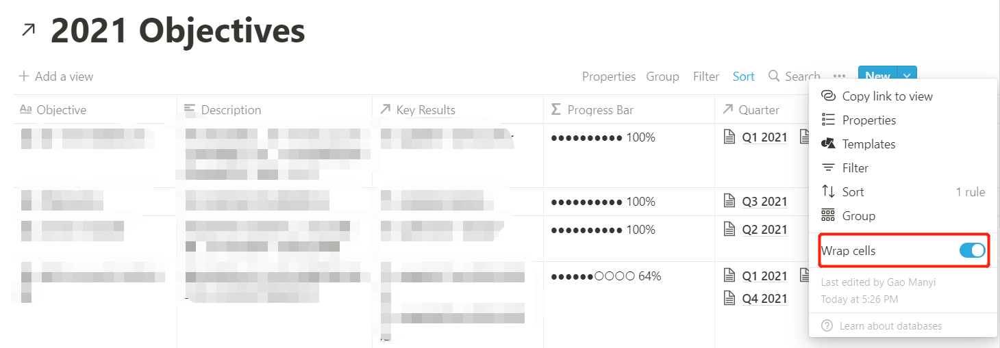
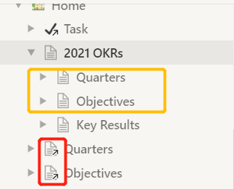

记录notion OKR的制作过程，以便以后查阅
<!--more-->

# Notion OKR制作教程

这是一个[OKR TEMPLATE](https://zhuanlan.zhihu.com/p/115082614)的制作细节，你可以在你自己的OKR上制作。或者在notion的market上直接购买。

## 关于OKR的概述

- OKR目标管理框架是诞生于intel，并在google开始流行
- 一个OKR由单个目标和多个关键结果组成
- 目标是一些定量定性的目标，它们雄心勃勃，鼓舞人心，通常成就率在70%左右。因此，OKR的分数并不能反映个人的表现。
- 关键结果是衡量达到目标的进展指标。通常一个OKR由2-5个关键结果构成。
- OKR通常是季度性设定的，可以为整个组织或者独立团队设定，但是通常来讲，独立个体不应该同时进行3个OKR。

- 目标的例子#1：成功开启一门中级的课程
  - 关键结果1：招收100名学生
  - 关键结果2：获得20个好评
  - 关键结果3：在3个博客上讨论这门课
- 目标的例子#2：提高品牌声誉
  - 关键结果1：通过在三个行业活动上演讲来培养品牌权威。
  - 关键结果2：识别并亲自接触50个客户。
  - 关键结果3：将客户询问的响应时间从4天缩短到1天，缩短75%。

# 创建主库

正如The Bulletproof Workspace所实现的，William对组织一个notion工作区的最重要建议是**将信息集中在主数据库中**，然后**创建访问该信息的“网关”**。您的OKR配置在主数据库中遵循了这一原则，主数据库之间以有用的方式相互关联。

## 创建Quarters库

出于按时间周期总结项目、任务和其他计划的目的，它有助于维护年、季度、月甚至天的主数据库，你的OKRs 将使用季度数据库。

- 在用于存储(而不是访问)信息的管理页面中，创建一个新的数据库。

- 将它命名为“Quarters” 并重命名`Title`字段为“Quarter”。

- 将一个placeholder类型的property替换为一个Date类型的property，并将其命名为”Time Span“

- 将另一个placeholder类型的property替换为一个Text类型的property，并将其命名为”Reflections“

- 删除其余剩下的placeholder类型的property

- 以”Q3 2021“的格式新增一系列的Quarter

- 对每个新增的Quarter，在”Time Span“的property上添加起止时间

- 关于filtering， 新加一个`Formula`类型的property，命名为”Active“，以此来表明当前生效的Quarter

- 在formula中输入以下代码

  ```js
  if(and(start(prop("Time Span")) <= now(), end(prop("Time Span")) >= now()), true, false)
  ```

- 后续可以将Active这个property隐藏起来

## 创建Objectives库

- 在Quarter库下面，创建另一个数据库，命名为”Objectives“，再将`Title`类型的property重命名为”Objective“
- 如果你想将你的目标分配给团队和他人，就可以相应的新增`Relation`，`Select`和`Person`类型的property
- 新增一个`Text`类型的property，命名为”Reflactions“
- 删除剩余的其他placeholder的property

## 创建Key Result库

因为Key Result是被用来衡量进度的指标，所以它需要”Target Value“ 和 ”Current Value“两种属性，有了这两种属性，便可以计算出"progress"这个属性的百分比

- 在目标库的下面，新增一个数据库，命名为”Key Results“，并且将`Title`类型的property重命名为“Key Result”

- 创建一个新的property 或者 替换掉一个placeholder类型的property：选择`Number`类型并且命名为“Current Value”

- 创建一个新的property 或者 替换掉一个placeholder类型的property：选择`Number`类型并且命名为“Target Value”

- 创建另一个property并命名为“Progress”，选择`Formula`类型

- 输入如下代码：

  ```
  prop("Current Value") / prop("Target Value")
  ```

  为了消除小数位，可以乘以100，在用`round()`函数，然后再除以100.

- 将“Progress”属性格式化为百分位：鼠标悬停在方框内，然后点击出现的`123`按钮，再选择`Percent`

# 创建OKRs

要查看剩余的功能并识别任何错误，添加一些初始okr—两个或更多。不用说，添加你的目标和关键结果各自的数据库;你马上就会把它们连起来。

您可以创建自己的okr，稍后再填写反思内容，但对于每个关键结果，请确保添加目标值和当前值，并确认进度计算正确。

# 关联数据库

有了三个数据库，您已经准备好将它们联系起来，以获得复杂的视角和见解。（关于`Relations` 和 `Rollups`，可以参考[The Power of Relations and Rollups](https://www.notion.vip/the-power-of-relations-and-rollups/)）

## 将Quarters关联到Objectives上

- 在季度库中，新增一个`Relation`属性，将其命名为“Objectives”，并选择你的目标库（如果你不想在视图中看到这个属性的话，可以将其隐藏）
- 在目标库中，重命名对应的`Relation`属性为“Quarter”
- 在这个Quarter属性中，选择你想给每个目标关联的季度

## 将Objectives关联到Key Result上

- 在目标库中，新增另一个`Relation`属性，命名为“Key Results”并选择关键结果库（同样的，如果不想在视图中看到这个属性，可以选择隐藏该属性）
- 在关键结果库中，重命名对应的`Relation`属性为“Objective”
- 针对每个关键结果，选择对应的目标

# 初始化Rollup

`Rollup`允许你从关联的字段中手机信息并且汇总起来

## 通过Objective来计算进度

对每个目标，`Rollup`属性将会计算每个关键结果的进度平均值。

- 在目标库中，新增一个`Rollup`属性命名为“Progress”
- 在Progress中点击任意一个方框初始化`Rollup`属性
- 针对`Relation`，选择Key Result属性
- 针对`Property`，选择Progress属性
- 针对`Calculation`，选择“Average”

## 通过Quater来计算进度

同样的，对每个季度，也会采用`Rollup`来计算进度，使用每个目标的Progress的平均值（此方法后来被我改成了使用该季度所有Key Result的Current Value和Target Value来计算了）

- 由于一个`Rollup`不能引用另一个`Rollup`，所以你需要反应每个目标的进度在`Formula`属性上。在目标库中，新增一个`Formula`属性，命名为“Progress（Formula）”。它的公式则可以简单的引用Progress属性，使用如下公式即可：

  ```js
  prop("Progress")
  ```

- 在季度库中，新增一个`Rollup`属性，命名为“Progress”

- 点击Progress中的任一空格初始化`Rollup`属性。

- 针对`Relation`，选择Objective属性

- 针对`Property`，选择“Progress（Formula）”属性

- 针对`Calculation`， 选择“Average”

## 创建可视化进度条

与一个标准的百分数不同的是，你可以在你的目标库和季度库中创建一个可视化的百分比进度。在每个库中：

- 创建一个新的`Formula`属性，命名为“Progress Bar”

- 新增一下公式：

  ```js
  if(round(prop("Progress") * 100) < 5, "○○○○○○○○○○", if(round(prop("Progress") * 100) >= 95, "●●●●●●●●●●", slice("●●●●●●●●●●", 1, round(prop("Progress") * 10) + 1) + slice("○○○○○○○○○○", 1, 11 - round(prop("Progress") * 10)))) + " " + format(round(prop("Progress") * 100)) + "%"
  ```

- 你可以选择隐藏原先的“Progress”属性

## 汇总你激活的指标

你肯定想知道是否一个目标在当前季度中实现。为了这个目的，你可以从相关联的季度中汇总“Active”的值：

- 在目标库中，新增一个`Rollup`属性命名为“Active”。选择Quarter属性作为`Relation`，然后Active属性作为`Property`。将"Show Original"作为`Calculation`。同样的，你也可以选择隐藏该属性。

## 通过可选择的汇总日期排序

如果你想按照时间来对目标和关键结果排序，你也可以从季度库中“汇总” Time Span属性：

- 在目标库中，新增一个`Rollup`属性命名为“Time Span”。选择Quarter属性作为`Relation`，然后选择Time Span作为`Property`，将"Show Original"作为`Calculation`。同样的，你也可以选择隐藏该属性。
- 为了在关键结果库中新增Time Span，你需要在目标库中创建一个“Time Span（Formula）”属性，就像“Progress（Formula）”一样。有了它，你可以在关键结果库中创建一个`Rollup`属性，引用到“Time Span（Formula）”zhong

# 为常用内置页设置模板

## 通过Quater来过滤Objective

当你打开你的季度页面时，你想看看关联的目标。为了实现它，你可以显示目标库作为一个内联的库，通过过滤来展示在特定季度内的目标。

你可以创建一个模板，而不是创建一个内建在每个季度的数据库：

- 在季度库的顶端，点击`new`按钮的箭头，选择`+ New template`
- 将Title字段命名为“New Quarter”
- 在页面内部，添加一个链接库，选择目标库
- 目标最好是以Galleries的视图（没有卡片预览）来呈现，并且使用Tables的视图来编辑。
- 针对每个视图，创建一个过滤器来显示那些目标的Quarter是“New Quarter”模板。
- 根据你的偏好来选择隐藏部分属性。

之后，每个通过“New Quarter”模板创建的季度都将显示相关联的关键目标了。

## 通过Objectives来过滤Key Results

同样的，你也希望每个目标显示对应的关键结果：

- 在目标库的顶端，点击`new`按钮的箭头，选择`+ New template`
- 将Title字段命名为“New Objective”
- 在页面内部，添加一个链接库，选择关键结果库
- 关键结果最好是以list的视图展示，所以创建一个list视图用于查看，创建一个table视图用于编辑
- 针对每个视图，创建一个过滤器，来展示目标是New Objective template的关键结果
- 根据你的偏好来选择隐藏部分属性。

之后，每个通过New Objective模板创建的目标将只展示它关联的目标。

# 为OKR创建网关

你将会很少的通过主数据库访问你的OKRs，相反，应该将内联的数据库放在一个有用的位置。就像季度的内部内容一样，目标可以很好地以Gallerier(带有进度条)方式呈现（可以在视图bar的右边点击`...`按钮，然后点击`Properties`按钮进入到编辑视图properties页面，在这里可以调整Gallery视图的卡片大小，卡片展示的内容等），它们也很容易以Table的方式被编辑

位置将取决于你的工作空间的结构，但这里有一些建议：

- 在你的主要的“home page”或者高级别的“dashboard”上显示当前季度的所有目标（通过Active季度过滤）
- 在你的团队范围内，显示相关联的目标。考虑以Gallery的视图呈现当前季度所有Active的目标，然后一个“table”的视图显示所有的目标的“Reflection”

# 撰写季度反馈

为了从okr中得到最大的收获，你需要在每个季度末对自己的表现进行评估。是什么导致了高成就率?是什么导致了低值?在每个目标的反射属性中做简明的笔记。

在每个季度的“Reflection”属性中，记下你最有用的收获。之后，你可以定期回顾你的经验教训，以支持未来的表现。

考虑创建一个包含链接数据库的“Reflection”页面，在表中显示所有的区域和目标。

# 撰写年度总结

可以直接将“网关”页的OKRs复制一份，放在年度目标页面下。

然后再输入`\`,创建一个`Create linked database`，来展示该年度的`Quarters `，`Objectives`, `Key Results` 等。

这样就可以在年度目标页面做总结，同时来年的OKRs，也无需再创建一遍，直接在原网关页面修改内容即可。

# Tips

- 使用`Wrap Cell`功能使得`Text`类型的`Properties`可以换行显示，而不是在单一行内容中显示：

  
  
- 带有个下面箭头标志的只是个引用，真实的内容还是page内的，所以在复制时，只复制引用的话，依旧会链接到原有的page内,修改原page内容会影响到引用的结果。如果想要复制后的内容不受原page修改的影响，则需要直接复制原page内容：

  

# 引用

[翻译原文出处](https://www.notion.vip/achieve-your-goals-okrs-in-notion/)


