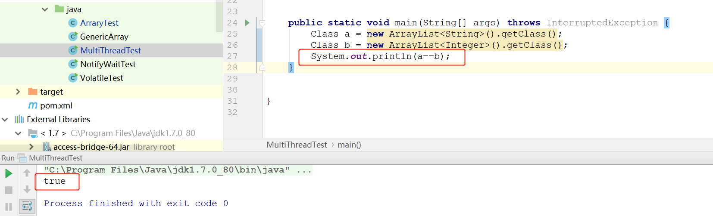

## 类型擦除

Java的泛型本质是参数化类型，就是将数据类型做为一个参数，在使用的时候再指定它的具体类型。但是因为Java使用了类型擦除，所以这个参数只存在于编译期，在运行期JVM是并不知道泛型的存在。

<!--more-->



上图运行结果可以看出，在JVM运行时将`new ArrayList<String>()`与`new ArrayList<Integer>()`看作是同一个class类。 

泛型参数会擦除到它的第一个边界。如果没有边界，则默认擦除到Object类。

> 无论我们如何定义一个泛型类型，相应的都会有一个原始类型被自动提供。原始类型的名字就是擦除类型参数的泛型类型的名字。
>
> 如果泛型类型的类型变量没有**限定(<T>) **，那么我们就用Object作为原始类型；
> 如果有限定(<T extends XClass>)，我们就XClass作为原始类型；
> 如果有多个限定(<T extends XClass1&XClass2>)，我们就用第一个边界的类型变量XClass1类作为原始类型； 

## 类型擦除带来的麻烦

###1. 泛型数组 

Java中不允许直接以这种方式创建泛型数组`List<String>[] c = new List<String>[3]` 。如果Java允许创建泛型数组则会产生一个下面的问题：

```java
List<String>[] lsa = new List<String>[10]; // Not really allowed.  实际上是不允许的
Object o = lsa;  //强转为Object类型
Object[] oa = (Object[]) o;  //强转为Object[]数组
List<Integer> li = new ArrayList<Integer>();  
li.add(new Integer(3));  
oa[1] = li; // Unsound, but passes run time store check 通过了存储校验  
String s = lsa[1].get(0); // Run-time error: ClassCastException.  产生类型强转异常
```

上面代码的最后一句会产生运行时异常。这是因为JVM进行类型擦除之后是不知道泛型信息的，而数组是有协变效应的。所以支持将不同数据类型的数据放入到`Object[]`类型的数组中，所以就会导致取出数据的时候产生`ClassCastException`。 在取出数据的时候，泛型可以使得编译期上述最后一行代码不需要进行类型强转也可以通过编译器的检查（这是泛型设计的作用之一），但是在实际运行过程中又产生了`ClassCastException` 异常，这违背了泛型的设计原则（在编译期不出现 `未经检查的转换` ，运行期就不会报出类型转换异常）。

Java允许创建无边界通配符类型的数组，如下：

```java
List<?>[] lsa = new List<?>[10]; // OK, array of unbounded wildcard type. 
Object o = lsa;
Object[] oa = (Object[]) o;
List<Integer> li = new ArrayList<Integer>();
li.add(new Integer(3));
oa[1] = li; // Correct. 
oa[2] = "123";//Object[]数组可以存储任意类型的对象数据
String s = (String) lsa[1].get(0); // Run time error, but cast is explicit. 
```

上述代码的最后一行也会产生运行期类型强转异常，但是使用类型通配符数组，在取出元素类型时，则需要显式的强转数据类型。这一点使得

> **协变：A是B的父类，并且A的容器也是B的容器的父类，则称之为协变。**

泛型是不支持协变的，但是支持“伪协变”，意思是指泛型本身不支持协变，但是可以通过设置上下边界来实现类似协变的特性。

### 2.泛型的多态 

我们先来看一个泛型父类：

```java
public class Fruit<T> {

    private T fruit;

    public Fruit(T fruit) {
        this.fruit = fruit;
    }
  
    protected T getFruit(){
        return this.fruit;
    }

    protected void setFruit(T f){
        this.fruit=f;
    }
}
```

如果一个子类试图重写父类的`getFruit`方法的话，则有如下代码：

```java
public class Apple extends Fruit<String> {

    private String name;

    @Override
    protected void setFruit(String f) {
       this.name = f;
    }
}
```

上面子类的`protected void setFruit(String f)` 方法试图覆盖父类的同名方法，但是实际上**由于泛型擦除的原因** 父类擦除后的set方法变成了`protected void setFruit(Object f)` 。此时，子类重写的方法与父类方法中的参数类型已不相同。因此，这样无法达到重写父类方法的目的。

在实际的重写中，编译器为我们解决了这个麻烦：

```java
/*编译器在子类中自动生成了一个桥方法，由这个桥方法重写了父类的方法，再调用我们重写的子类方法*/
protected void setFruit(Object f){
	setFruit（（String）f）；
}
```

如此一来，相当于在子类自动生成了个代理方法来解决了泛型由类型擦除带来的多态问题

如果在子类中我们再试图复写父类的`get` 方法的话,则会产生一个与我们自己定义的`get` 方法签名相同但是返回参数不同的桥方法：

```java
    /*我们在子类中自己定义的重写方法*/
    protected String getFruit() {
        return this.name;
    }
    /*编译器自动生成的桥方法*/
    protected Object getFruit() {
        return getFruit();
    }
```

事实上，这个桥方法在编译器中存在是合法的。且看下面的几个知识点：

> - 方法签名 确实只有方法名+参数列表 。这毫无疑问！
> - 我们绝对不能编写出方法签名一样的多个方法 。如果这样写程序，编译器是不会放过的。这也毫无疑问！
> - 最重要的一点是：JVM会用参数类型和返回类型来确定一个方法。 一旦编译器通过某种方式自己编译出方法签名一样的两个方法(只能编译器自己来创造这种奇迹，我们程序员却不能人为的编写这种代码)。JVM还是能够分清楚这些方法的，前提是需要返回类型不一样。

### 3.泛型中方法的冲突

如果我们在一个泛型类中定义了一个如下所示的`equals` 方法，则编译器会不让通过：

```java
// 编译不通过
public boolean equals(T obj) {
        return super.equals(obj);
}
```

则会有如下错误：

> 【Error】    Name clash: The method equals(T) of type Pair<T> has the same erasure as equals(Object) of type Object but does not override it。

其中原因正是由于泛型的类型擦除，导致我们编写的`equals` 方法变成了`public boolean equals(Object obj)` 。此方法签名与`Object` 类中的`equals`方法签名相同。这就变成了覆盖父类的方法，然而我们的本意并不是想覆盖父类的方法。因此，如果这里编译器不报出错误的话，会给程序猿隐形中带来一个大坑。

### 4.创建泛型实例

通过`new` 关键字创建泛型是不可行的，一是由于泛型擦除，二是由于编译器不知道T是否有默认的构造器。可以通过以下几种方法来创建泛型的实例：

####  1. 传递一个工厂对象，并且通过它来创建实例 

```java
interface FactoryI<T> {
    T create();
}
class Foo2<T> {
    private T x;
    public <F extends FactoryI<T>> Foo2(F factory) {
    x = factory.create();
    }
    // ...
}
class IntegerFactory implements FactoryI<Integer> {
    public Integer create() {
    return new Integer(0);
    }
}
class Widget {
    public static class Factory implements FactoryI<Widget> {
        public Widget create() {
            return new Widget();
        }
    }
}
public class FactoryConstraint {
    public static void main(String[] args) {
        new Foo2<Integer>(new IntegerFactory());
        new Foo2<Widget>(new Widget.Factory());
    }
}
```

创建一个创建实例的工厂对象，在泛型类中使用工厂对象来创建泛型实例。然后每个实例的具体类型自己实现工厂方法的接口，创建自己的实例即工厂对象，作为构造器入参传递给泛型类的构造器。

#### 2. 利用模板设计模式

```java
abstract class GenericWithCreate<T> {
    final T element;
    GenericWithCreate() { element = create(); }
    abstract T create();
}
class X {}
class Creator extends GenericWithCreate<X> {
    X create() { return new X(); }
    void f() {
    System.out.println(element.getClass().getSimpleName());
    }
}
public class CreatorGeneric {
    public static void main(String[] args) {
        Creator c = new Creator();
        c.f();
    }
}
```

将创建实例的工作放在钩子方法中，通过子类去实现它，以达到创建实例的目的。

#### 3. 利用Class类的反射

```java
public <T> T getObject(Class<T> t) throws Exception {
	return t.newInstance();
}
```

### 5. 静态方法与泛型

静态方法有一种情况需要注意一下，那就是在类中的静态方法使用泛型：**静态方法无法访问类上定义的泛型；如果静态方法操作的引用数据类型不确定的时候，必须要将泛型定义在方法上。**

即：**如果静态方法要使用泛型的话，必须将静态方法也定义成泛型方法** 。

```java
public class StaticGenerator<T> {
    ....
    ....
    /**
     * 如果在类中定义使用泛型的静态方法，需要添加额外的泛型声明（将这个方法定义成泛型方法）
     * 即使静态方法要使用泛型类中已经声明过的泛型也不可以。
     * 如：public static void show(T t){..},此时编译器会提示错误信息：
          "StaticGenerator cannot be refrenced from static context"
     */
    public static <T> void show(T t){

    }
}
```

### 6. 泛型类与异常

1. 泛型类不能继承Throwable类，所以泛型类的对象既不能捕获也不能抛出。

```java
public class Problem<T> extends Exception {
	... 
}
```

假设上面是合法的，那么在catch的时候，我们就可以有如下的方式：

```java
try {
	...
} catch (Problem<String> e1) {
	
} catch (Problem<Integer> e1) {
	
}
```

Problem类在编译后会擦除泛型信息，这就相当于上面同时catch住了两个相同的异常，这在Java语法中是不允许的。

1. 不能在catch子句中使用泛型变量，如：

```java
public static <T extends Throwable> void doSomething(Class<T> t){
    try {
        ...
    } catch (T e) { //编译错误
        ...
    }
}
```

假设上面合法，那么下面的情况就会导致catch顺序不符合Java语法：

```java
public static <T extends Throwable> void doSomething(Class<T> t){  
    try {  
        ...  
    } catch(T e) {  //此处泛型擦除后变成了 catch（Throwable e）
        ...  
    } catch(IndexOutOfBounds e) {  
        ...
    }                           
}
```


## ？与T的区别

- 如果类型参数在方法声明中只出现一次，可以用通配符代替它。
- 当一个泛型用来表达方法的两个参数之间的关系时，则需要应该使用T，如：

```java
public static <T> T autoConvertType(T obj)
{
     return(T)obj;
}
```

- ?表示不确定的类型，T表示一个固定的类型，可以作为一个变量类型在方法体的函数中调用，如：

```java
public static void printColl(ArrayList<T> al){  
        Iterator<T> it = al.iterator();  
        while(it.hasNext())  
        {  
            T t = it.next();  
            System.out.println(t.toString());  
        }  
}
```

## 为什么需要引入泛型

- **保证代码类型安全。**


在编译期不出现 `未经检查的转换` ，运行期就不会报出类型转换异常。

- **提高了代码可重用性**

在《Java核心技术》中对泛型的定义是：

> “泛型” 意味着编写的代码可以被不同类型的对象所重用。

在泛型中，可以将不同数据类型作为参数来使用，这就可以使得不同数据类型公用同一套代码，自然提升了代码的可重用性。

> 泛型接口比较实用的使用场景就是用作策略模式的公共策略

作为策略模式的公共策略，会被很多类实现，同时需要支持传入不同的数据类型作为参数。

```java
public interface Comparator {

    public int compare(T lhs, T rhs);

    public boolean equals(Object object);
}
```

泛型接口定义基本的规则，作为引用传递给客户端，这样就可以在运行的时候传入不同的策略实现类。

- **消除强制类型转换**


存储任意类型的数据在集合中，但是取出来的时候都是object类型，此时必须强转。使用了泛型之后，编译器会自动插入类型转换的代码。所见即所得，使用时直接得到目标类型。

- **为了创建容器类**

根据《Java 编程思想》中的描述，泛型出现的动机在于：

> 有许多原因促成了泛型的出现，而最引人注意的一个原因，就是为了创建容器类。

在《effective java》中也建议使用List来代替Array，因为List可以保证编译期的类型安全，而Array不能。

## 何时产生未经检查的异常

使用泛型类或泛型方法时，没有指定参数化类型的具体数据类型是什么的时候，编译器会自动检查泛型的参数化类型，会报出未经检查的异常。


以上内容来自于对其他博客的整理和自己的思考,参考文章链接如下：

[**参考文章一**](https://segmentfault.com/a/1190000005337789)

[**参考文章二**](https://juejin.im/entry/584abdff61ff4b0058d50547#%E6%B3%9B%E5%9E%8B%E7%9A%84%E7%B1%BB%E5%9E%8B%E6%93%A6%E9%99%A4) 

[**参考文章三**](https://www.cnblogs.com/ggjucheng/p/3352519.html)  

[**参考文章四**](http://hinylover.space/2016/07/03/relearn-java-generic-2/)

[**参考文章五**](https://blog.csdn.net/s10461/article/details/53941091#t11)

