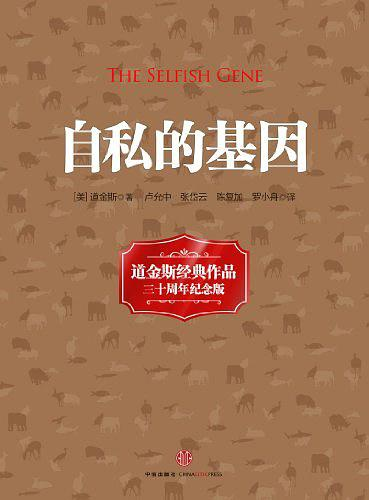
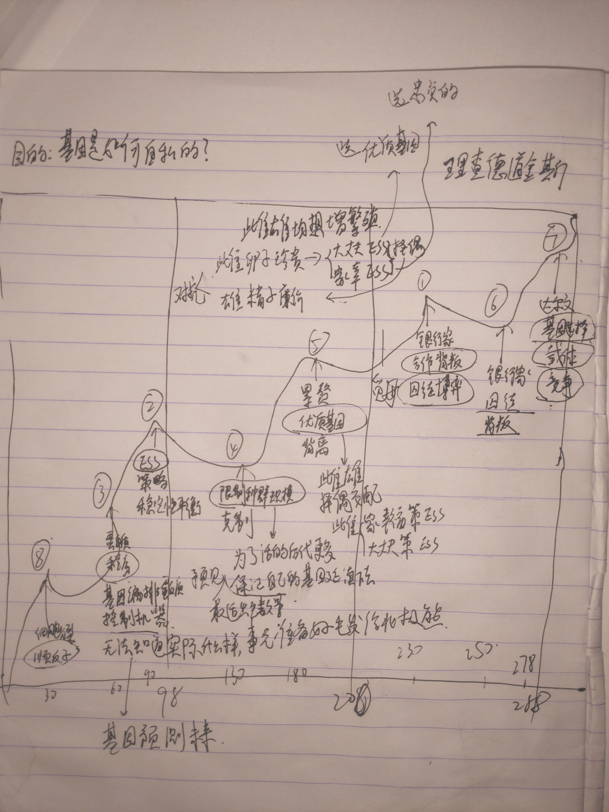

这本书开始的时候，作者提出了达尔文进化论的物竞天择，适者生存中的“适者”到底是什么？是种群，个体，还是物种？都不是，在作者看来，基因是自然选择的单位。而所有的动物，植物，个体，都是基因控制的生存机器而已。基因的目的只有一个，那就是复制自己。所以，从这个角度出发，就有了这本书的名称——自私的基因。

<!--more-->

基因的目的是为了让自己复制下去。所以他们选择了各种各样的策略，让自己尽可能的复制下去。那些会控制蛋白质给自己制造生存机器的基因则更大概率能在自然选择的情况下生存下去。所以自然选择使得制造生存机器的基因可以不断地复制，生存下来。于是，基因通过控制蛋白质合成的方式，来控制着生存机器。而基因无法知道，动物会在生存过程中遇到什么样的情况。所以它们会给这些动物，预先制定好策略。比如它们不知道北极熊出生后，会面临哪些遭遇。但是基因会给北极熊准备好厚厚的毛发，来帮助他们御寒。这就是基因的预测行为，它其实就像程序员写的代码一样。只是指定了固定模式下的蛋白质合成方式，而不去关心实际代码所处理的数据。

作者在这本书中又提到了进化稳定性策略（ESS），这种策略是一种自然选择上稳定性的策略，一旦一种稳定性策略确立起来之后，任何偏离这种策略的行为都会受到自然选择的惩罚。而这种策略的稳定性，并不在于它有利于这个群体中的个体，而是因为它的内部没有背叛行为。一个生物种群理论上可以达到多种稳定性策略，但是最终会以一种稳定性策略方式生存下去，这将取决于他们优先达到了哪一种稳定性策略。从基因的角度来说，基因库是由一组进化上稳定的基因形成的，这组基因成为一个不受任何新基因侵犯的基因库。而大部分因为基因突变、重新组合而产生的新基因，将会偏离这种稳定性策略，必然会受到自然选择的惩罚。但是新基因侵入一组稳定性基因库，偶尔也会获得成功。一旦成功，就会立马在基因库中散布开来，最终形成一组新的稳定性策略。按照这种进犯策略类推，一个种群可以从一个稳定性进化策略跳向另外一个稳定性进化策略。这就是进化的过程。

把个体动物视为独立的生存机器，便于理解进犯行为。但是如果有关个体是近亲的话，这一模式也许会失去效用，因为近亲体内存在着很大一部分共同的基因，而每一个基因同时需要忠于不同的个体。从基因的角度，也可以解释我们的近亲利他主义。如果一个个体为了拯救十个近亲而牺牲，操作个体对亲属表现利他行为的基因，就有可能因此失去一个拷贝，但同时，一个基因的大量拷贝却得以保存。从这个角度来说，父母之爱和兄弟姐妹的利他行为的形成，都可以用完全相同的原因来解释，在收益者体内存在这个利他性基因的可能性更大。

同时从自私的基因角度来看，很多生物界的动物会选择自发的计划生育。而他们这种行为的目的，其实是为了让自己后代的成活率更高，以保证自己的基因可以复制延续下去。

在父母与子女之间也存在着欺骗和自私行为，而这种行为正是自私基因的延伸。幼儿欺骗父母，为了获取更多的食物和理想的生存条件，是为了使基因可以复制下去。而父母防止幼儿欺骗，是为了使自己的基因，可以更好的复制到下一代身上去。因为父母能够能够给的资源是有限，而他们为了使自己的基因可以复制下去，必须选择性的将更多的资源给活下去可能性更大的子女。这些只是从基因的角度来说，不牵涉到任何有意识的行为。

> 如果说我们从中有什么可以借鉴的话，那么就是我们必须把利他主义的美德，灌输到我们子女的头脑中去，因为我们不能指望他们的本性中有利他主义的成分。

在自然界中，雌性的卵子比较珍贵，而雄性的精子相对廉价。所以雌雄两性为了使自己的基因有更大的可能性复制下去，他们分别进化出不同的策略来对抗对方。在书中，作者提到雌性可以选择大丈夫策略或者家庭幸福策略来选择自己的配偶。而雄性则会有不同的策略来对抗。

作者在书中还提出了一种新的复制基因。叫做meme(觅母)。作者认为，文化的传播和遗传相类似，即它能导致某种形式的进化。遗传的进化能以存在于一种稳定状态，向另一种稳定状态转变而取得进展。而觅母，从广义上说可以称为模仿过程，从一个大脑转向另一个大脑的过程。以这样的方式在觅母库中进行繁殖。觅母和基因一样，也是自私的。

> 然而，即使我们着眼于阴暗面，假定人基本上是自私的。我们自觉的预见能力，能够防止自己纵容盲目的复制基因，干出那些最坏的、过分的自私行为。在必要时，我们也可以抗拒那些灌输到我们头脑里的自私觅母，我们甚至可以讨论如何审慎的培植纯粹的，无私的利他主义，这种利他主义在自然界里是没有立足之地的。在整个世界历史上也是前所未有的，我们是作为基因机器而被建造的，是作为觅母机器而被培养的，但我们具备足够的力量去反对我们的缔造者，在这个世界上只有我们，我们人类，能够反抗自私的复制基因的暴政。

关于自然界中的互惠利他行为，作者也通过自私基因的角度来给出了解释。这里作者提出了，一个经典的，博弈论概念。叫做囚徒困境。在简单的囚徒困境中。无论怎么算，最好的策略是永远背叛，因为这是个零和博弈。然而所幸，在自然界中，我们并不是处于简单的囚徒困境中，而是充满了囚徒困境的重复博弈，这是一个非零和博弈。在有记忆的生物中，对于这种囚徒困境的重复博弈，我们最好的策略是：**合作与互助 **。也就是说，**好人终有好报。** 

一想到人一生下来就有太多的东西是受基因控制的，就不免感到有点悲哀。我们的一切行为，所有的本能和心理因素都受着基因的影响，不过所幸，我们是可以反抗的。