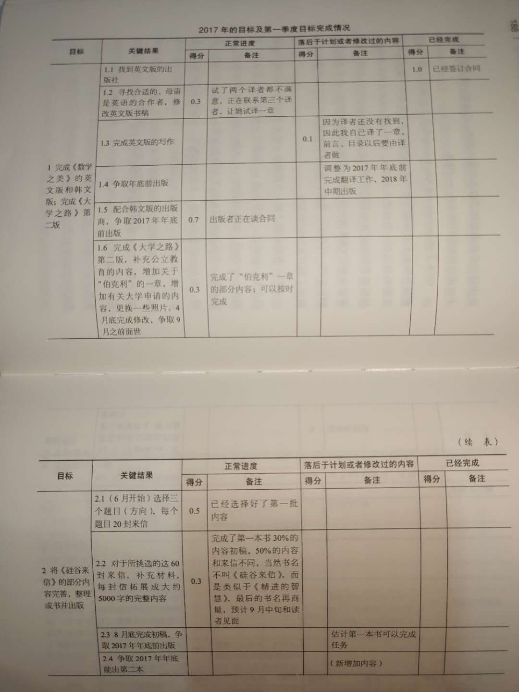
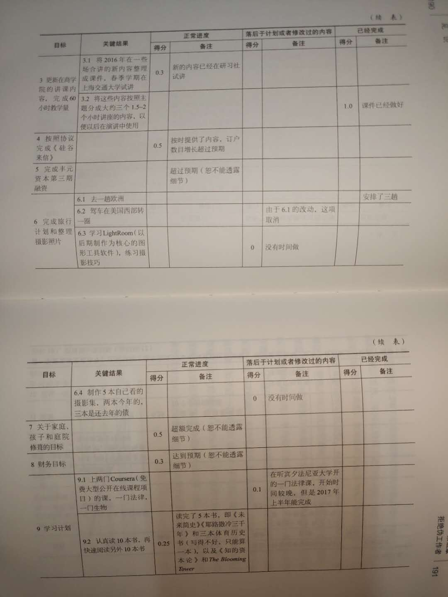
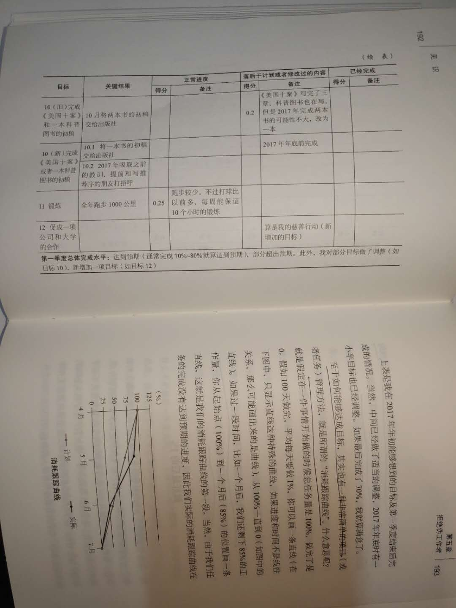
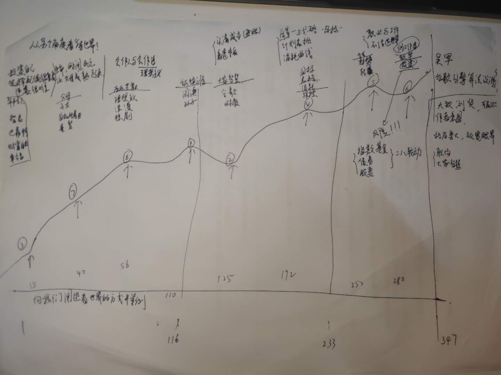

《见识》这本书是偶然从一个公众号的文章推送里面得知的。后来得知是吴军写的便直接买回来看看。写这篇文章是为了记录下读了这本书之后所收获到的几点。

从整体上来说，这本书阐述了吴军老师对人生、对职业、对投资的思考和建议。

<!--more-->

## 一、关于人生

从这个角度来说，我喜欢这本书的第一章标题，叫做**幸福是目的，成功是手段。**这章里面作者说，一个人需要相信自己的命运。而关于命，每个人是有不同的理解。

> 命运取决于两个因素，一个是环境因素，是由我们的出身和环境来决定的。而另一个是我们自己对未来走向的规划，这一点是我们自己努力博弈出来的。所谓的命，我们能掌握的就是一个人看问题和做事情的方法，仅此而已，但是他们决定了一个人的一生。

一个人的出生、生活环境和他受到的教育都会对他整个人生的命运产生非常大的影响。而我们常说”命运是掌握在自己的手里“指的是我们可以规划自己的未来方向，通过自己的努力获得想要的人生。对于一个普通人来说，想要逆袭是非常难，非常难的一件事情。作者在书中举了个例子说你可能需要花半辈子时间，来弥补自己的不足。然后再花半辈子的时间来追赶别人。因为别人的先天条件比你好的话，那么可能他只要付出三分的努力，就可以达到你付出十分努力所带来的效果。因此你必须要花很长的时间来弥补自己的不足，然后再努力的去追赶人家的脚步。

### 1.对男生女生的建议

人生最重要的投资其实是投资自己。对男生来说，选择好一个配偶十分重要。一个女生，她所表现出来的气质涵养，实际上跟她的家庭有很大的关系。选择一个聪明的跟你价值观完全相符合的女生，这对于你自己人生的未来会大有裨益。同时，男生需要有足够的独立性，承担自己未来对家庭的义务。在一段婚姻中，双方都需要明白关系的亲密程度和重要性依次是**“夫妻优先于子女，更优先于双方的父母。”**

有很多人觉得结婚是两个家庭的事情。然而在这本书里面，作者说，婚姻它并不一定是两个家庭的事情，而是两个人要分得清楚大家和小家。两个人在婚姻中需要分清大家和小家之间的边界。

> 一个人，特别是年轻的时候，可塑性非常重要。两个人在一起时间一长，肯定会遇到矛盾，能够有一些柔韧，彼此妥协的解决问题，相互适应，才能更好、更长远的走下去。

对于女生来说，需要分清楚婚姻与恋爱的不同。恋爱是激情，是化学物质分泌所带来的愉悦；而婚姻则是两个人共同构造一个舒适体。在这个舒适体中，双方都会受益，彼此成长。不要总觉得老实的男人才能靠的住，或者找一个自己可以控制的人。因为你会发现很多身边看似老实的男人，会做出一些让你们大跌眼镜的事情。其实这些东西它本质上并没有什么意外的，因为人性就摆在那里。女生应该靠自己的能力去辨别一个，对自己好的男生。而对自己好，不应该靠男生怎么说来评判，要去发现他是怎么做。需要判断这个人的价值观和爱情观是否与自己相符，是否认可夫妻间的关系的重要性高于其他关系的重要性。只要仔细观察就可以发现他对你们之间关系的在乎程度。

> 当然，一个男生最终能否对你好，还要看他有没有这个能力。因为大部分男生都会描绘一个美好的未来，但是很多人根本无力去实现它。

### 2.做人和作诗

最近我在办公室中，跟一些同事玩得越来越熟。有些同事会说我是一个很会说话的人。当我听到他们这样评价我的时候，其实我的内心对自己多少是有点失望的。因为我知道自己不是个情商很高的人，我只是会偶尔抖个机灵，然后不向别人吝啬我的赞美。可能这些东西在别人的眼中，会有拍马屁的倾向。在这本书里面，作者把这些东西称之为会做人。在这个社会中并不缺会做人的人，但是缺会做诗的人。

这里的作诗指的是，他们有一种理想主义式的叛逆精神。在我的理解里，这大概是一种纯粹的理想主义。有一些了解我的朋友，可能因为觉得我喜欢老罗而认为我是个很理想主义的人。但是我其实更倾向于把自己归结为是一个现实理想主义者。我非常的认同和赞美理想主义精，但是我觉得脱离了现实的理想主义行为，是一种非常不理智的，甚至会给自己和家人带来生活上的窘境的行为。当然我更不喜欢那些把自己利益看得很重的精致利己主义者。我喜欢的是像鲁迅那样，一边拿着国民政府的钱，一边去骂国民政府。大概我的信条是应该在很多事情上有着理想主义的原则，但是不能脱离现实而活着。守住自己的底线，照顾好自己的家人，而不是用一种很幼稚的理想主义行为去跟这个丑恶世界进行搏斗。

### 3.非线性增长

这本书的第四章叫做大家智慧。作者写了一些名人的故事，他告诉我们，**做事情要认清成本并且看透本质。**关于看透本质这件事情，我有另外个理解，叫做非线性增长。这是我从投资理念中学来的，不管是人生还是投资，在很多的时候都不是一个线性增长的过程。它是一个缓慢的由量变累积产生质变的非线性增长过程。它需要前期不断的进行投入累积，达到了临界点之后，发生一个突变带来很多的回报。所以我们需要看透这个增长过程的本质是非线性的，并不是投入多少就会得到多少回报。而是需要找到那个临界点，不断的积累，之后就会产生质变获得很大的收益。

就拿工作这件事情来说，工资的增长并不是线性的，它是一个人内在价值的外在定价。所以说，作者给毕业生的建议是，在工作的前三年不要太去关注工资多少，而需要关注的是自己内在价值的提升。你自己的内在价值才是工资的本质。等过了几年工作上有了很好的工作经验的累积和技能的提升。这些内在价值的积累产生质变就会体现在你的工资的大幅增长上，会很容易的翻倍增长。这一点跟延迟满足感也是同样的道理。就是说我们需要放弃前期短暂的满足感，而不断的积累，坚持到未来产生更大的收益。

### 3.做好最后的1%

在做事情的时候，需要做好最后的1%。因为其实很多时候人与人之间的能力差距并没有那么大，但是正是这最后的1%却会拉开很大的差距。这一点是我需要始终铭记的，我在很多方面的最后1%都做的不够好。

## 二、关于职业

### 1. 职业误区

在职业方面，作者给我最大的启发是：**不要走入一个工作和职业分不清的误区。**

工作是谋生的手段，你去单位上班然后单位给了你一份工资就两清了。然而，职业却是需要从事一辈子的事情。为了这个一辈子的发展，应该选择性的做一些对职业有利的事情，不论是否有报酬或者报酬的高低。

对待自己的职业需要专业的工作态度。所谓的专业，就是一切以工作目标达成为中心，所有的会议、沟通都是以此为核心。不管在任何情况下，能够把事情做好才能够体现出你的职业素质。成为一个专业人士，也是我入职以后，邹总在给我们的新人培训中所提出的一点希望。希望我们能够专业人士的态度，把属于自己的每件事情做好，而不去考虑当前的一些短暂利益。

另外一个启发是：**不要把自己当成一个单位的过客，而是将自己当成主人。**对比我之前在恒生的工作经验来说，我其实从一开始入职恒生的时候，就想把恒生作为一个不错的跳板。其实这样的想法对我来说是非常不利的。在整个工作过程中，我并没有去做一个专业人士应该做的事情。所以我希望在以后我所经历的每一家公司，都有一种主人翁的意识。不仅仅需要把这当成是一份工作，而是当成我的职业来做。成为一个专业的人士，对我来说很重要。

为了避免陷入这些误区，作者给我们提出了几个解决办法：

- 第一，任何时候都要为人谦卑，只有谦卑才能更有效的沟通。
- 第二，要用正确的方法对待语言暴力和其他故意伤害。
- 第三，永远要明确工作不是为了公司或者他人，而是为了自己的职业发展这个既定的大方向。想要成为领导者，要平实的学习做一个领导。走出自己的一亩三分地，主动的多做事情，多跟人打交道，去帮助他人，支持自己的老板和团队。
- 第四，注重长期效益，把一件事情放到2到3年的时间周期来看，这时候我们对它的态度就会完全的不同。永远在一家公司不要有过客心态，要抱着学本事的心态去专心的干事情。
- 第五，作为一个基层员工，需要有大局观。你不仅需要看到你工作中所专注的一些细节，你需要看到整个项目，整个团队是如何运行的。

### 2. 伪工作者

作为一个程序员，我自然的想要在工作的时候追求效率减少加班。在这本书中，作者提出了我们要拒绝做一个伪工作者。

- 我们首先需要确定，**愿景-目标-道路。**愿景就是说我们要确定一个明确的方向，然后在这个明确的方向上，我们需要设置一些阶段性的目标，战略的核心就是达到这些既定的目标，进而实现我们的愿景。
- 第二点是，即使听到了不中听的话也一定要虚心找出其中的合理之处。每次遇到别人和自己意见相左时，一定要开启寻找对方合理性的开关，这样会对你自己有很大的提升。
- 第三点时，凡事要做记录。做记录的过程其实是，有思考了一遍，这样会使得你进步更快。

同时作者还分享了自己谷歌目标工作管理方法。将自己的年度目标，列成一个表格。然后再制作一个消耗跟踪曲线来跟踪自己的目标完成情况。

## 三、关于投资 

### 1.金钱观

这本书的最后一部分作者关于投资的一些看法。每个人都需要有一个正确的金钱观和理性的投资观。首先是金钱观，在现实生活中，要有那种没有钱是万万不能的思想。如果太过理想的去抛弃了很多东西的话，只会让你的生活变得很糟糕，并且没有能力照顾你的家人。鲁迅先生自己曾讲，饭碗可以跟理想分开。每个人都需要在这个现实的世界中很好的生活下去，所以你需要努力的保住你的饭碗。这一点是非常重要的。

另外一点是：**钱只有花出去了，才是你的。**在很多时候，我们不应该吝啬自己。就我自己来说，凡是我觉得会提高自己生活品质的东西就肯定会买。但是我会根据自己的收入，来分配投资和消费的比例。因为有些东西，它并不是很紧急的。比如我最近一直想买的键盘和音箱，但是我这个月已经买了手机，而这些东西又不是非常紧急。所以，我可以把剩下的钱部分用作生活费，另一部分用作投资理财。等下个月的工资发下来之后，再去买键盘和音响。

### 2.投资观

再来说说投资观。因为我的工作跟金融有关，同时我也很爱钱。所以很自然的对投资理财感兴趣。之前我读过一本书，它说你在投资的时候，首先需要确定的一点就是**风险意识。**我一开始并不知道怎么看待这个风险意识。但是关注了这个行业一段时间之后，就发现那些很著名的理财投资人，他们都会给自己和自己的家庭买上各种各样的保险。其实保险它的本质上就是转移你的生活风险。大家都知道，在现实生活中，一场疾病很可能会把一个家庭的财务状况给带入低估。但是如果我们提前配置了保险的话可能情况就会好很多，这就是风险意识的一种体现。

其实不仅是理财，在生活中的任何事情都有风险，如果我们提前有了风险意识，并且对可能发生的这些风险的情况，作出应对策略的话，那么我们就可以很好的应对生活中的那些未知情况。

这本书里作者提出的投资些思想和投资观点，跟我以前对于投资的认识是很相似的，比如专业人士并不一定会比我们自己投资做的好。

对于投资来说，最好的投资品种还是权益类产品。这里的权益类产品指的是债券、股票、指数基金等。从历史数据来看，不论是哪个国家，投资股市都是回报率最高的一种方式。而单个股票的投资风险是很高的，因为它存在于价值归零的可能。但是如果你投资指数基金的话，情况就完全不一样。你只要在指数低估的区间买入，然后长期持有或者定期投入的话，就可以获得一个相对不错的收益。所以对于普通的上班族来说，努力工作扩大每月的现金流，然后将每月的闲钱去投资到指数基金中，会给我们带来相对不错的受益。同时我们需要有足够的风险意识，给自己配置上保险来应对可能发生的亏损情况。

